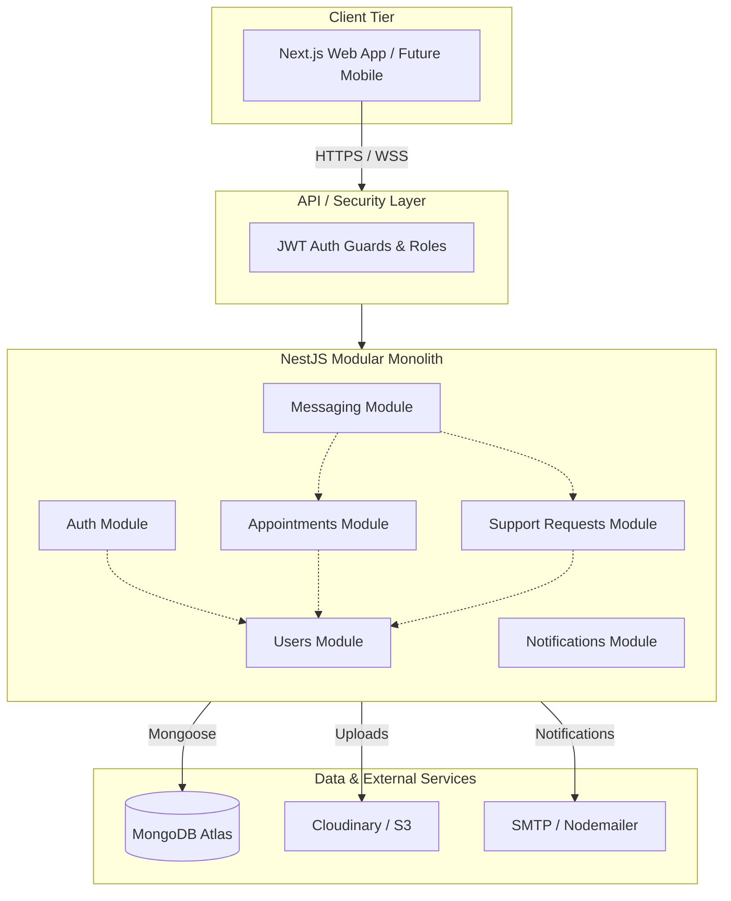
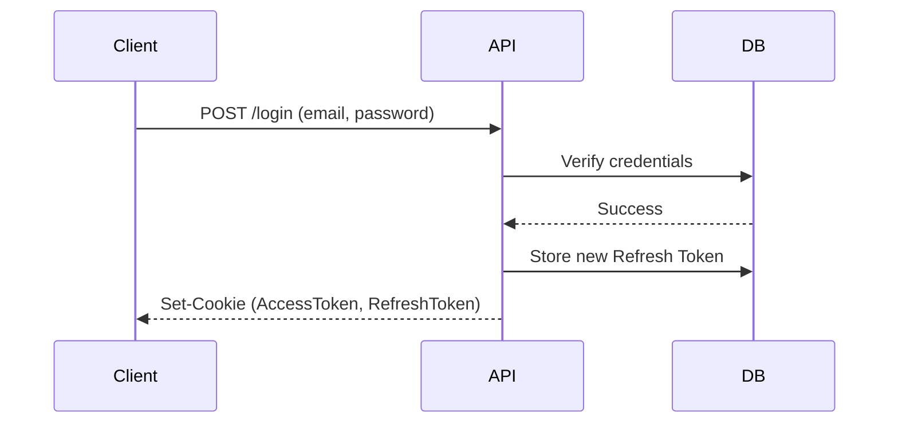
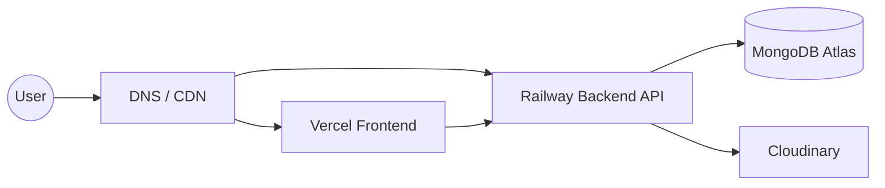

# Ashwasa - Architecture Document

This is the master architecture document for Ashwasa, a Digital Health & Support Coordination Platform.

## 1. Architecture Overview

- **Architecture pattern:** Modular Monolith
- **Architecture goals:** Maintainable, Secure, Modular, Testable, Scalable, Accessible, Observable



## 2. Technology Stack (final decisions)

- **Frontend:** Next.js 15 (App Router), TypeScript, Tailwind CSS, shadcn/ui, React Hook Form, Zod, Socket.io-client
- **Backend:** Node.js 20 LTS, NestJS 10, TypeScript, Mongoose, Passport.js, Socket.io, Nodemailer, Multer, Sharp, Helmet, class-validator, class-transformer
- **Database:** MongoDB 7 (Atlas)
- **Infrastructure:** Vercel (frontend), Railway (backend), MongoDB Atlas, Cloudinary/S3 (files)

## 3. Frontend Architecture

### Detailed Directory Structure

```text
frontend/
├── app/
│   ├── (auth)/           # Login, Register, Verify, Reset
│   ├── (dashboard)/      # Role-based dashboards
│   │   ├── patient/
│   │   ├── doctor/
│   │   ├── family/
│   │   ├── volunteer/
│   │   └── admin/
│   ├── layout.tsx
│   └── page.tsx          # Landing
├── components/
│   ├── ui/               # shadcn/ui primitives
│   ├── forms/
│   ├── layouts/
│   └── shared/
├── features/             # Feature-specific components
│   ├── auth/
│   ├── appointments/
│   ├── support-requests/
│   ├── messaging/
│   ├── profiles/
│   └── admin/
├── lib/                  # Utilities, API client, constants
├── hooks/                # Custom React hooks
├── services/             # API service functions
├── types/                # TypeScript type definitions
├── schemas/              # Zod validation schemas
└── config/               # App configuration
```

- **Server Components vs Client Components strategy:** Server Components by default for better performance and SEO. Client Components used only where interactivity (hooks, state, event listeners) is required.
- **State management:** React Context + useReducer for global state like auth/theme. No Redux needed for MVP as state is mostly server-derived.
- **Form architecture:** React Hook Form for state management + Zod resolvers for schema-based validation.
- **API communication:** Fetch-based service layer with typed responses mapping to backend endpoints.
- **Route protection:** Middleware-based auth checks + role-based layout guards to ensure appropriate access.
- **Error boundaries, loading states (Suspense), empty states:** Comprehensive UI states to handle data fetching lifecycle and fallback UI cleanly.
- **Layout strategy:** `(auth)` group for public unauthenticated views, `(dashboard)` group for protected views, nested layouts tailored per role.

## 4. Backend Architecture (NestJS Modular Monolith)

### Detailed Module Structure

```text
backend/src/
├── auth/           # Registration, Login, JWT, Email verification, Password reset
├── users/          # User CRUD, profile management, role management
├── patients/       # Patient-specific profile, linked family
├── doctors/        # Doctor profile, verification, availability
├── volunteers/     # Volunteer profile, verification, availability
├── family/         # Family linking (invite codes), patient relationship
├── appointments/   # Booking, accept/reject, calendar, cancellation
├── support-requests/  # CRUD, assignment, status workflow
├── messaging/      # Conversations, messages, WebSocket gateway
├── notifications/  # In-app + Email notifications, event-driven
├── resources/      # Articles, categories (Admin-managed)
├── files/          # Upload, validation, storage integration
├── admin/          # Verification queue, moderation, analytics
├── audit/          # Audit log recording
├── common/         # Guards, decorators, pipes, filters, interceptors
└── config/         # Environment, database, external services config
```

### Module Responsibilities

- **auth:** Manages authentication flows including registration, login, and token issuance.
  - *Controllers:* AuthController (login, register, verify, refresh).
  - *Services:* AuthService, JwtStrategy.
  - *Dependencies:* users, notifications.
- **users:** Core user management and role assignment.
  - *Controllers:* UsersController.
  - *Services:* UsersService.
  - *Dependencies:* auth (for validation).
- **patients:** Patient profiles and associated data.
  - *Controllers:* PatientsController.
  - *Services:* PatientsService.
  - *Dependencies:* users.
- **doctors:** Doctor profiles, availability, and verification status.
  - *Controllers:* DoctorsController, AvailabilityController.
  - *Services:* DoctorsService.
  - *Dependencies:* users.
- **volunteers:** Volunteer profiles and vetting.
  - *Controllers:* VolunteersController.
  - *Services:* VolunteersService.
  - *Dependencies:* users.
- **family:** Manages connections between patients and family members via invite codes.
  - *Controllers:* FamilyController.
  - *Services:* FamilyService.
  - *Dependencies:* patients, users.
- **appointments:** Scheduling, accepting, rejecting, and cancelling doctor appointments.
  - *Controllers:* AppointmentsController.
  - *Services:* AppointmentsService.
  - *Dependencies:* doctors, patients.
  - *Events Emitted:* `appointment.requested`, `appointment.accepted`, `appointment.rejected`.
- **support-requests:** Volunteer support task lifecycle.
  - *Controllers:* SupportRequestsController.
  - *Services:* SupportRequestsService.
  - *Dependencies:* patients, volunteers.
  - *Events Emitted:* `supportRequest.assigned`.
- **messaging:** Real-time chat functionality.
  - *Controllers:* MessagingController, MessagingGateway (WebSocket).
  - *Services:* MessagingService.
  - *Dependencies:* users, appointments, support-requests.
  - *Events Emitted:* `message.new`.
- **notifications:** Delivery of system and email notifications based on events.
  - *Controllers:* NotificationsController.
  - *Services:* NotificationsService, EmailService.
  - *Dependencies:* users.
- **resources:** Management of educational/support articles.
  - *Controllers:* ResourcesController.
  - *Services:* ResourcesService.
- **files:** Centralized file handling and uploads.
  - *Controllers:* FilesController.
  - *Services:* FilesService, StorageService.
- **admin:** System oversight and user verification queue.
  - *Controllers:* AdminController.
  - *Services:* AdminService.
  - *Dependencies:* users, doctors, volunteers, audit.
- **audit:** Recording of sensitive actions.
  - *Controllers:* None.
  - *Services:* AuditService.

## 5. Authentication Architecture

- **Strategy:** JWT with HttpOnly Secure cookies (access token) + refresh token rotation.
- **Access token:** 15 min expiry, stored in HttpOnly Secure SameSite=Strict cookie.
- **Refresh token:** 7 day expiry, stored in DB, rotated on use, revokable.
- **Registration flow:** email + password + role → verification email → click link → account active.
- **Login flow:** email + password → validate → issue access+refresh tokens → set cookies.
- **Password reset:** email → time-limited token → reset form → hash + save.
- **Account lockout:** 5 failed attempts → 15 min lockout.
- **Session revocation:** Delete refresh token from DB.
- **Rate limiting:** 5 login attempts/min, 3 password resets/hour.
- **Why cookies over localStorage:** XSS protection, automatic inclusion in requests, server-side revocation.



## 6. Authorization Architecture

- **RBAC:** using NestJS Guards + custom decorators.
- **@Roles() decorator + RolesGuard:** For role-level access.
- **@OwnershipGuard:** For object-level access (e.g., patient can only access own appointments).
- **Permission check flow:** JWT → Identity → Role → Permission → Resource Ownership.
- **Backend independently verifies ALL access** — frontend route guards are UX only.
- **Specific rules:**
  - *PATIENT:* Own data + granted family access.
  - *FAMILY_MEMBER:* Linked patient data (patient must grant via invite code).
  - *DOCTOR:* Own data + basic profile of patients with active appointments.
  - *VOLUNTEER:* Own data + details of accepted support requests.
  - *ADMIN:* All non-encrypted data, verification queue, moderation.

## 7. Messaging Architecture

- **Protocol:** WebSocket (Socket.io) for real-time + REST fallback.
- **Data model:** Conversation (participants, linked entity) → Messages (sender, content, timestamp, status).
- **Authorization:** Messaging ONLY allowed between users with active appointment or support task.
- **Flow:** Client connects via Socket.io → authenticates with JWT → joins conversation rooms → sends/receives messages.
- **Offline:** Messages persisted in MongoDB, marked unread, delivered on reconnect.
- **Read receipts:** client emits `message:read` event → update message status.
- **Notifications:** New message triggers in-app notification + optional email.

## 8. Notification Architecture

- **Event-driven:** using NestJS EventEmitter (NOT Kafka/RabbitMQ for MVP).
- **Events:** `appointment.requested`, `appointment.accepted`, `appointment.rejected`, `message.new`, `supportRequest.assigned`, `user.verified`.
- **Channels:** In-app (stored in Notification collection, fetched via API/pushed via WebSocket), Email (Nodemailer via SMTP).
- **Preferences:** Users can toggle email notifications (stored in user profile).
- **Retry:** Failed emails retry 3 times with exponential backoff.
- **Idempotency:** Event ID used as dedup key.

## 9. File Upload Architecture

- **Types:** Profile images (JPG/PNG, 2MB max), Verification docs (PDF/JPG/PNG, 5MB max).
- **Flow:** Client → multer (memory storage) → validate type+size → Sharp (resize images) → upload to Cloudinary/S3 → store URL + metadata in MongoDB.
- **Access control:** Verification docs accessible only by Admin + document owner; profile images public.
- **Signed URLs:** For private files.
- **Deletion:** When user deletes account, files are deleted from storage.

## 10. Search Architecture

- **MVP:** MongoDB indexes (compound indexes on frequently queried fields).
- **Doctors:** Index on `{ specialty, city, isVerified, isAcceptingPatients }`.
- **Support Requests:** Index on `{ status, category, city, createdAt }`.
- **Resources:** Index on `{ title (text), category }`.
- **Text search:** MongoDB text indexes for resource keyword search.
- **Future:** MongoDB Atlas Search for full-text search if needed.

## 11. Caching Strategy

> Redis is deferred until a measurable performance requirement exists.
- **For MVP:** In-memory caching for config values, role definitions.
- **HTTP caching headers:** for static resources.
- **Next.js ISR/SSG:** for resource articles.
- **Rationale:** MongoDB with proper indexes meets <300ms P95 target; adding Redis adds operational complexity.

## 12. Background Jobs

- **MVP:** NestJS built-in `@Cron()` decorator (via `@nestjs/schedule`).
- **Jobs:**
  - Email sending (async, non-blocking)
  - Stale account cleanup (unverified accounts >30 days)
  - Expired refresh token cleanup
  - Notification retry for failed emails
- **Future:** Bull/BullMQ if job volume increases.

## 13. Error Handling

- **Centralized NestJS Exception Filter.**
- **Standard error response format:**
```json
{
  "statusCode": 422,
  "error": "VALIDATION_ERROR",
  "message": "Validation failed",
  "details": [ { "field": "email", "message": "Invalid email format" } ],
  "timestamp": "2024-01-01T00:00:00Z",
  "requestId": "uuid"
}
```
- **Error categories:** 400 Validation, 401 Unauthenticated, 403 Forbidden, 404 Not Found, 409 Conflict, 429 Rate Limited, 500 Internal.
- **NEVER** expose stack traces, DB errors, or internal details in production.
- **Request ID** attached to every response for debugging.

## 14. Observability

- **Application Logging:** Structured JSON logs (Winston/Pino), levels: debug/info/warn/error.
- **Security Logging:** Failed logins, password resets, permission denials, suspicious activity → separate log stream.
- **Audit Logging:** All admin actions, verification decisions, account suspensions → persisted in AuditLog collection.
- **Metrics:** API latency, error rates, auth failures, message throughput.
- **Monitoring:** Health check endpoint (`/api/v1/health`), uptime monitoring.

## 15. Testing Architecture

- **Frontend:** Vitest + React Testing Library (component), Playwright (E2E).
- **Backend:** Jest (unit + integration), Supertest (API tests).
- **E2E critical paths:** Registration → Verification → Login, Appointment booking flow, Support request → Volunteer assignment, Admin verification queue.
- **Target:** 70% coverage on critical paths.

## 16. CI/CD Architecture

- **GitHub Actions pipeline:**
  PR → Lint → Type Check → Unit Tests → Integration Tests → Build → Security Scan (npm audit) → Deploy.
- **Environments:** Development (auto-deploy on main push), Staging (manual trigger), Production (manual approval).
- **Branch strategy:** `feature/*` → `main` (with PR reviews).

## 17. Environment Architecture

- **Environments:** Development, Testing, Staging, Production.
- **Config:** `.env` files (gitignored) + environment variables in deployment platform.
- **Required env vars:** DATABASE_URL, JWT_SECRET, JWT_REFRESH_SECRET, SMTP_*, CLOUDINARY_*, FRONTEND_URL, BACKEND_URL.
- **Secrets:** NEVER in Git. Managed via Railway/Vercel environment variable UI.
- **Database separation:** Separate MongoDB databases per environment.

## 18. Scalability Strategy

- **10 users:** Single Railway instance + MongoDB Atlas free tier.
- **100 users:** Same, monitor performance.
- **1,000 users:** Add MongoDB indexes, optimize queries, consider connection pooling.
- **10,000+ users:** Horizontal scaling (multiple Railway instances behind load balancer), Redis for sessions/caching, separate WebSocket server, MongoDB Atlas M10+.
- **Stateless backend:** (JWT in cookies) enables horizontal scaling without sticky sessions.

## 19. Deployment Architecture

- **Frontend:** Vercel (automatic from Git, edge network, ISR support).
- **Backend:** Railway (Docker container, auto-scaling, health checks).
- **Database:** MongoDB Atlas (managed, automated backups, monitoring).
- **Files:** Cloudinary (image optimization, transformations, CDN).
- **DNS:** Custom domain → Vercel (frontend) + Railway (backend API).


