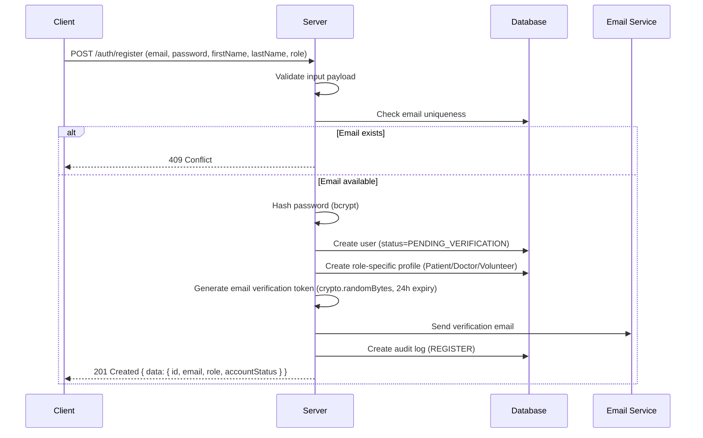
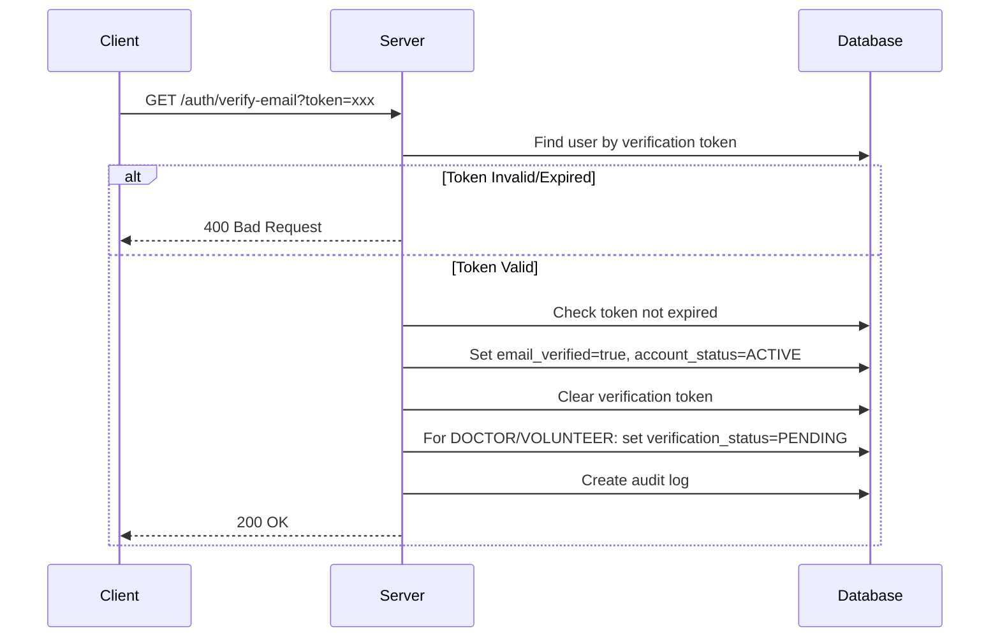
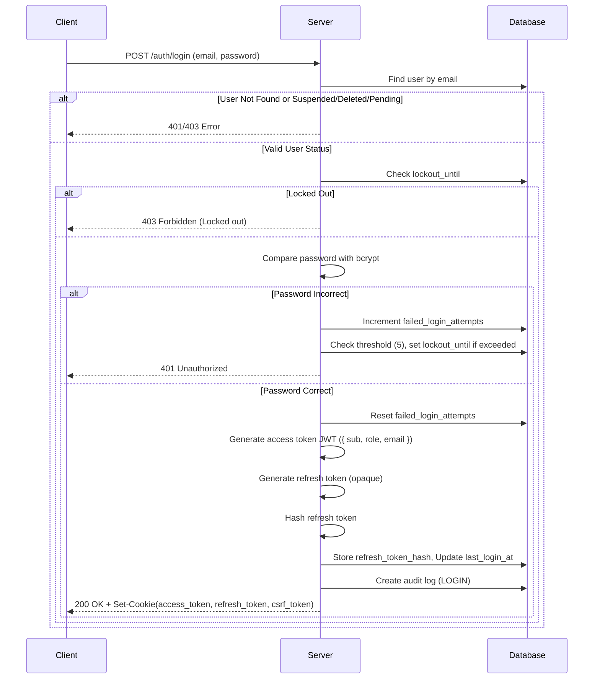
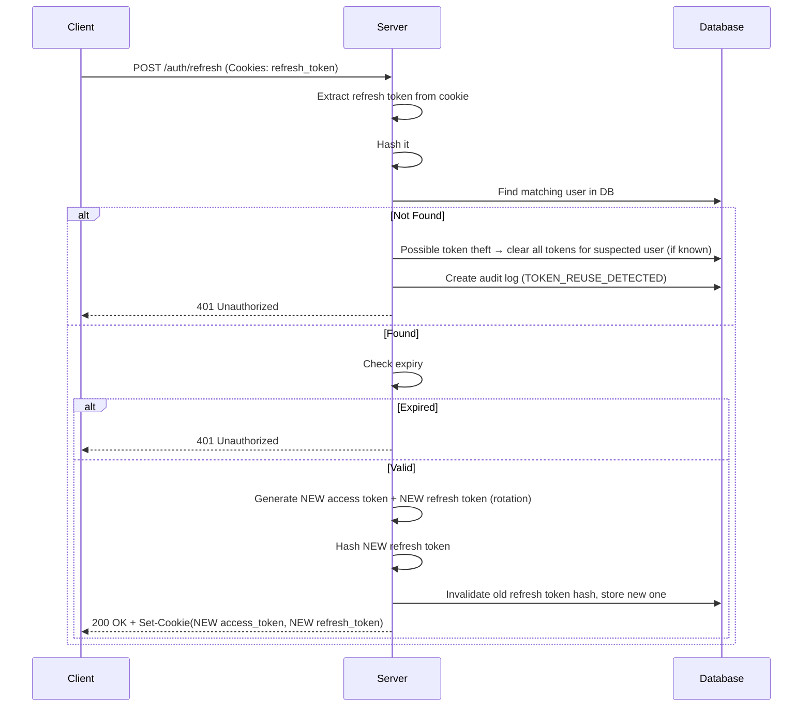
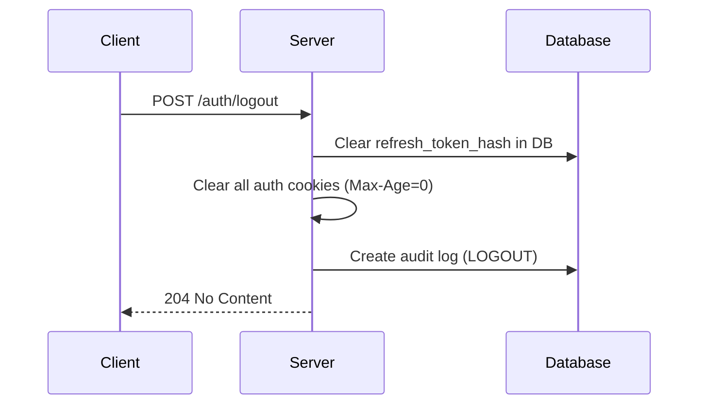
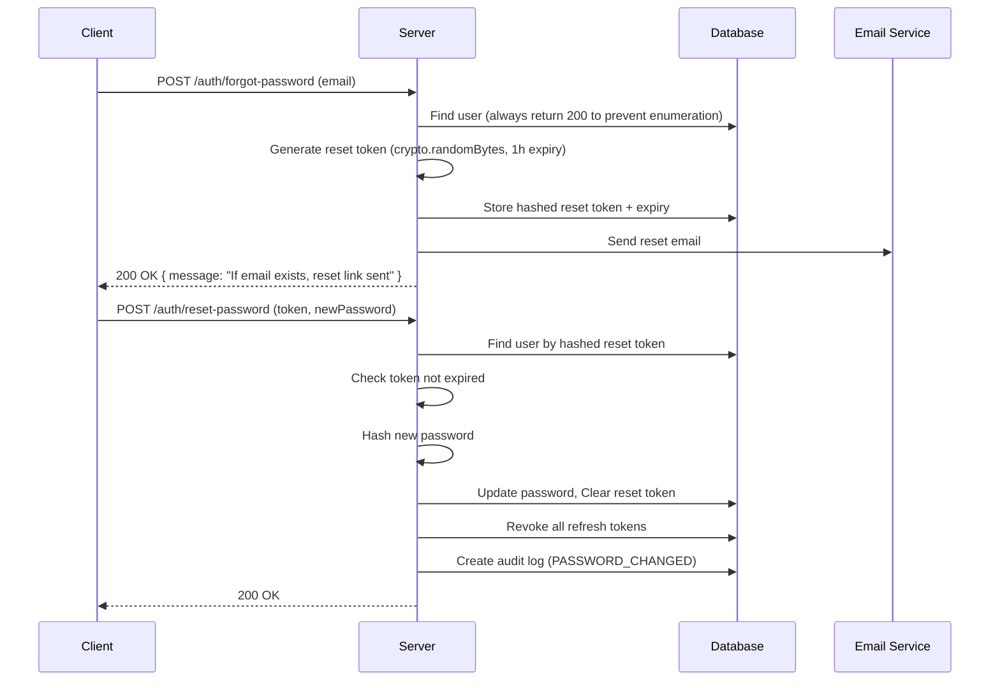

# Ashwasa: Authentication Contract

This document outlines the authentication architecture and contract for the Ashwasa platform. 

## 1. Authentication Strategy

- **Access Token**: JWT, 15 minute expiry, stored in `HttpOnly` + `Secure` + `SameSite=Strict` cookie named `access_token`.
- **Refresh Token**: Opaque token (generated via `crypto.randomBytes`), 7 day expiry, stored hashed (SHA-256) in `users.refresh_token_hash`, sent in `HttpOnly` + `Secure` + `SameSite=Strict` cookie named `refresh_token`, path restricted to `/api/v1/auth/refresh`.
- **Password Hashing**: `bcrypt` with cost factor 12.
- **CSRF Protection**: Double-submit cookie pattern. The server sets a `csrf_token` cookie (not HttpOnly), and the client reads it and sends it via the `X-CSRF-Token` header on state-changing requests (POST, PUT, PATCH, DELETE).

## 2. Registration Flow

**Note**: The `ADMIN` role cannot be self-registered. Admin accounts must be provisioned via a secure script or by an existing Super Admin.



## 3. Email Verification Flow



## 4. Login Flow



## 5. Token Refresh Flow

Refresh token rotation: Every refresh generates a new pair. Old refresh token is immediately invalidated. If a previously-invalidated refresh token is used (reuse detection), ALL refresh tokens for that user are revoked.



## 6. Logout Flow



## 7. Password Reset Flow



## 8. Account Lockout

- After 5 failed login attempts: lockout for 15 minutes.
- Lockout is per-account (not IP-based).
- Lockout counter resets on successful login.
- Failed attempts logged to audit log.

## 9. Session Revocation

- **Logout**: clears the specific refresh token.
- **Password Change**: revokes all sessions (clears refresh tokens).
- **Admin Suspend**: revokes all sessions.
- **Refresh Token Reuse Detection**: triggers full revocation to protect against session hijacking.

## 10. Cookie Configuration

| Cookie | HttpOnly | Secure | SameSite | Path | Max-Age |
|---|---|---|---|---|---|
| `access_token` | Yes | Yes | Strict | `/` | 900 (15 min) |
| `refresh_token` | Yes | Yes | Strict | `/api/v1/auth/refresh` | 604800 (7 days) |
| `csrf_token` | No | Yes | Strict | `/` | 604800 (7 days) |

## 11. JWT Payload

The JWT payload is minimal to reduce payload size and avoid transmitting sensitive data. Role is included for fast Guard checks but is verified against the DB for critical/destructive operations.

```json
{
  "sub": "user-uuid",
  "role": "PATIENT",
  "email": "user@example.com",
  "iat": 1690000000,
  "exp": 1690000900
}
```
