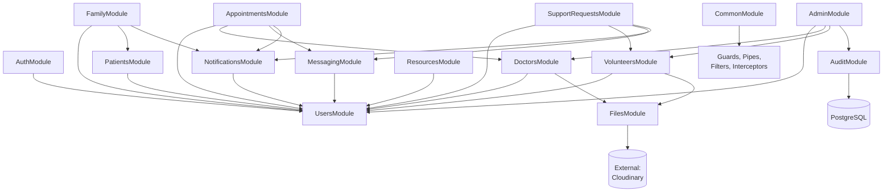

# Ashwasa API & Backend Contract Design

## 1. API Architecture & Request Flow

The backend follows a layered architecture utilizing NestJS features to separate concerns effectively.

```mermaid
flowchart TD
    Client[Client] -->|HTTP Request| Middleware[CORS/Helmet\nMiddleware]
    Middleware --> CookieParser[Cookie Parser]
    CookieParser --> RateLimiter[Rate Limiter]
    RateLimiter --> AuthGuard[Auth Guard (JWT)]
    AuthGuard --> RolesGuard[Roles Guard]
    RolesGuard --> OwnershipGuard[Ownership Guard]
    OwnershipGuard --> ValidationPipe[Validation Pipe\n(class-validator)]
    ValidationPipe --> Controller[Controller]
    
    subgraph "NestJS Application Layer"
        Controller -->|DTO| Service[Service Layer]
        Service -->|Events| EventEmitter[Event Emitter]
    end
    
    subgraph "Data Access Layer"
        Service -->|Prisma Client| Repository[Prisma Repository]
    end
    
    Repository <-->|TCP| Database[(PostgreSQL)]
    
    Controller -.->|Response| Interceptor[Response Interceptor]
    Service -.->|Throws| ExceptionFilter[Exception Filter]
    ExceptionFilter -.->|Formatted Error| Client
    Interceptor -.->|Formatted Data| Client
```

### Layer Responsibilities:
- **Middleware**: Applies CORS policies, Helmet security headers, cookie parsing, injects unique request IDs (`x-request-id`), and handles basic request logging.
- **Guards**: 
  - **Authentication**: Extracts and verifies JWT from HttpOnly cookies.
  - **Role Authorization**: Ensures the user has the required role (e.g., PATIENT, DOCTOR) for the endpoint.
  - **Resource Ownership**: Verifies the authenticated user owns or has rights to the requested resource.
- **Pipes**: Global validation pipe uses `class-validator` and `class-transformer`. Enforces strict DTO validation, whitelists unknown properties, and transforms payloads.
- **Controller**: Manages route handling and HTTP concerns (status codes, headers). Delegates all processing to services. **NO business logic** resides here.
- **Service**: Contains core business logic, enforces state machine transitions, performs complex authorization checks, and emits domain events.
- **Repository/Prisma**: The data access layer handling query building, relations, and transactions.
- **Interceptors**: Transforms successful responses into the standard format, handles logging, and tracks performance.
- **Exception Filters**: Catches unhandled exceptions, maps internal errors to standard HTTP status codes, redacts PII, and formats standard error responses.

## 2. API Versioning Strategy

- **Base URL**: `/api/v1/`
- **Versioning Strategy**: URL path prefixing.
- **Future Versions**: E.g., `/api/v2/`. Introduced *only* for breaking changes.
- **Backward Compatibility**: Additive changes (new fields, new endpoints, new query parameters) do NOT require a new version. Clients must ignore unrecognized fields.
- **Breaking Changes**: Field removal, type changes, semantic behavior changes require a new API version.
- **Deprecation Policy**: Minimum 3-month notice. Responses for deprecated endpoints will include a `Sunset` header and documentation updates.
- **Migration**: Both versions (v1 and v2) will run simultaneously during the transition period.

## 3. Standard Response Format

**Success (Single Resource):**
```json
{
  "data": {
    "id": "123e4567-e89b-12d3-a456-426614174000",
    "email": "user@example.com",
    "createdAt": "2026-08-12T06:00:00Z"
  },
  "meta": {
    "requestId": "987fcdeb-51a2-43d7-9012-3456789abcde"
  }
}
```

**Success (Collection):**
```json
{
  "data": [
    { "id": "...", "title": "..." },
    { "id": "...", "title": "..." }
  ],
  "meta": {
    "total": 42,
    "page": 1,
    "limit": 20,
    "totalPages": 3,
    "requestId": "987fcdeb-51a2-43d7-9012-3456789abcde"
  }
}
```

**Success (No Content):** 
HTTP 204 No Content. Empty body.

**Success (Created):** 
HTTP 201 Created. `data` contains the newly created resource, `Location` header is set to the resource URI.

*Decision:* No `success: true` wrapper. HTTP status codes (2xx) natively convey success, simplifying frontend consumption.

## 4. Standard Error Format

All errors return a predictable JSON structure handled by the global exception filter.

```json
{
  "error": {
    "code": "APPOINTMENT_CONFLICT",
    "message": "The selected time slot is no longer available.",
    "details": [
      {
        "field": "startTime",
        "message": "This slot has already been booked"
      }
    ],
    "requestId": "987fcdeb-51a2-43d7-9012-3456789abcde",
    "timestamp": "2026-08-12T06:00:00Z"
  }
}
```

**Error Code Convention:** `DOMAIN_ACTION_REASON` (e.g., `AUTH_LOGIN_INVALID_CREDENTIALS`).

## 5. Error Catalog (Summary)

*(See `error-catalog.md` for the exhaustive list)*

**Auth:** `AUTH_INVALID_CREDENTIALS`, `AUTH_EMAIL_NOT_VERIFIED`, `AUTH_ACCOUNT_SUSPENDED`, `AUTH_ACCOUNT_LOCKED`, `AUTH_TOKEN_EXPIRED`, `AUTH_TOKEN_INVALID`, `AUTH_REFRESH_TOKEN_INVALID`, `AUTH_REFRESH_TOKEN_REUSED`, `AUTH_EMAIL_ALREADY_EXISTS`, `AUTH_WEAK_PASSWORD`.
**Authorization:** `FORBIDDEN_ROLE`, `FORBIDDEN_OWNERSHIP`, `FORBIDDEN_RELATIONSHIP`, `FORBIDDEN_UNVERIFIED`.
**Validation:** `VALIDATION_FAILED`.
**Appointments:** `APPOINTMENT_CONFLICT`, `APPOINTMENT_INVALID_TRANSITION`, `APPOINTMENT_SLOT_UNAVAILABLE`, `APPOINTMENT_DOCTOR_NOT_VERIFIED`, `APPOINTMENT_DOCTOR_NOT_ACCEPTING`.
**Support Requests:** `SUPPORT_REQUEST_ALREADY_ASSIGNED`, `SUPPORT_REQUEST_INVALID_TRANSITION`.
**Messaging:** `CONVERSATION_NOT_PARTICIPANT`, `CONVERSATION_CLOSED`, `MESSAGE_UNAUTHORIZED`.
**Family:** `FAMILY_INVITE_EXPIRED`, `FAMILY_INVITE_INVALID`, `FAMILY_DUPLICATE_RELATIONSHIP`.
**Files:** `FILE_TOO_LARGE`, `FILE_INVALID_TYPE`, `FILE_UPLOAD_FAILED`.
**General:** `RESOURCE_NOT_FOUND`, `RATE_LIMIT_EXCEEDED`, `INTERNAL_ERROR`.

## 6. HTTP Status Code Strategy

| Status | When Used | Example |
|---|---|---|
| **200 OK** | Successful GET, PATCH, PUT | Fetching profile, updating appointment details |
| **201 Created** | Successful POST creating a resource | Booking a new appointment, creating a support request |
| **204 No Content** | Successful DELETE, successful action with no response body | Logout, marking a notification as read |
| **400 Bad Request** | Malformed request syntax | Invalid JSON, missing Content-Type |
| **401 Unauthorized** | Missing or invalid authentication credentials | Expired JWT, no session cookie |
| **403 Forbidden** | Authenticated, but lacks required permissions | Wrong role, trying to access another user's data |
| **404 Not Found** | Resource doesn't exist OR requester can't see it | Non-existent appointment, accessing unowned resource |
| **409 Conflict** | State conflict preventing the action | Double-booking, registering duplicate email |
| **422 Unprocessable Entity** | Valid syntax, but semantic errors | Invalid state transition, DTO validation failures |
| **429 Too Many Requests** | Rate limit exceeded | Too many failed login attempts |
| **500 Internal Server Error** | Unexpected server error | Unhandled exception, database connection failure |

*Note on 404 vs 403:* 404 is returned instead of 403 for resources the user doesn't have access to in order to prevent information leakage (enumerating valid resource IDs).

## 7. Pagination Strategy

- **Default Strategy**: Offset-based (`page` + `limit`) for most resources (Users, Appointments, Requests).
- **Cursor-based**: Used for highly dynamic, high-volume, chronological data (Messages).
- **Default Limit**: `20`
- **Max Limit**: `100` (enforced globally to prevent DOS).
- **Query Params (Offset)**: `?page=1&limit=20`
- **Query Params (Cursor)**: `?cursor=uuid&limit=50&direction=before`

## 8. Filtering, Sorting, Searching

- **Filters**: Via standard query params (`?status=CONFIRMED&category=TRANSPORT`). All filter values are validated against ENUMs via DTOs.
- **Sorting**: `?sortBy=createdAt&sortOrder=desc`. Sort fields are explicitly whitelisted per resource DTO. *Never* allow arbitrary DB column names.
- **Search**: `?search=keyword`. Server-side sanitized. Uses PostgreSQL GIN indexes and `tsvector` for efficient text search where applicable.

## 9. Rate Limiting Strategy

| Endpoint Group | Limit | Window | Key |
|---|---|---|---|
| `POST /auth/login` | 5 | 1 min | IP |
| `POST /auth/register` | 3 | 1 min | IP |
| `POST /auth/forgot-password` | 3 | 1 hour | IP |
| `POST /auth/verify-email` | 5 | 1 min | IP |
| `POST /messages` | 30 | 1 min | User ID |
| `POST /files/upload` | 10 | 1 hour | User ID |
| `GET /doctors` (search) | 30 | 1 min | IP + User ID |
| Admin APIs | 100 | 1 min | User ID |
| General API | 100 | 1 min | User ID |

*Response Headers included:* `X-RateLimit-Limit`, `X-RateLimit-Remaining`, `X-RateLimit-Reset`.

## 10. Idempotency Strategy

- **Header**: `Idempotency-Key` (UUID generated by client).
- **Applicable endpoints**: Appointment creation, Support request creation, File upload completion.
- **Mechanism**: The server stores the `Idempotency-Key` -> `Response` mapping in Redis/DB for 24 hours.
- **Behavior**: Duplicate requests with the same key immediately return the cached response without re-executing business logic.

## 11. Transaction & Concurrency Strategy

| Operation | Strategy | Details |
|---|---|---|
| **Appointment booking** | Prisma transaction + `SELECT FOR UPDATE` | Locks the availability slot to prevent double-booking. |
| **Volunteer task acceptance** | Prisma transaction + Optimistic Locking | `UPDATE ... WHERE id = X AND status = 'OPEN'`. Prevents multiple claims. |
| **Family relationship** | Prisma transaction | Atomically updates relationship status and creates an initial family conversation. |
| **User status change** | Prisma transaction | Atomically updates the user record and creates an audit log entry. |
| **Token rotation** | Prisma transaction | Atomically invalidates the old refresh token and creates a new one to prevent reuse. |

## 12. Backend Module Contract



**Module Responsibilities:**
- **AuthModule**: Login, registration, token issuance, password reset. Emits `user.registered`.
- **UsersModule**: Core profile management, role associations.
- **AppointmentsModule**: Booking, cancellation, status tracking. Emits `appointment.created`, `appointment.cancelled`.
- **SupportRequestsModule**: Volunteer matching, request lifecycle. Emits `request.created`, `request.assigned`.
- **CommonModule**: Shared global infrastructure (AuthGuard, RolesGuard, Exceptions).

## 13. External Services

| Service | Purpose | Failure Behavior | Timeout | Retry Policy |
|---|---|---|---|---|
| **Cloudinary** | Image/file storage | File upload fails → return 500, queue for background retry if async | 10s | 3 retries, exponential backoff |
| **SMTP (Nodemailer)** | Email notifications | Log failure, mark notification FAILED in DB, retry via cron job | 5s | 3 retries, exponential backoff |
| **PostgreSQL** | Primary Database | Fatal — service unavailable (500) | 5s | Auto-reconnect managed by Prisma pool |

## 14. API Security Checklist

| Threat | Mitigation Strategy |
|---|---|
| **Broken Access Control** | Ownership Guards (`@RequireOwnership`) on every user-specific endpoint. |
| **IDOR** | Return `404 Not Found` (instead of 403) for resources the user cannot access. |
| **XSS** | Input sanitization via `class-validator`, strict CSP headers via Helmet. |
| **CSRF** | `SameSite=Strict` cookies + Double Submit Cookie / CSRF token for state-changing requests. |
| **SQL Injection** | Prisma ORM handles parameterization natively. Raw SQL is strictly parameterized. |
| **Mass Assignment** | DTOs with explicit `@Allow`/`@Expose` whitelists. `ValidationPipe` set to `whitelist: true, forbidNonWhitelisted: true`. |
| **Parameter Pollution** | Validation pipe strips unknown query parameters. |
| **Enumeration** | Generic error messages for auth (`Invalid credentials` instead of `User not found`). |
| **File Upload Attacks** | Strict MIME type validation, size limits (max 5MB), random UUID renaming, no execute permissions. |
| **Session Theft** | Tokens stored in `HttpOnly`, `Secure`, `SameSite=Strict` cookies. Short-lived JWT (15m), automatic refresh rotation. |

## 15. Validation Rules

| Field | Rules |
|---|---|
| **email** | Required, valid email format, max 255 chars, lowercase trimmed. |
| **password** | Required, min 8 chars, must contain uppercase, lowercase, number. |
| **firstName / lastName** | Required, min 1 char, max 100 chars, trimmed, no HTML tags. |
| **phone** | Optional, valid format (E.164), max 20 chars. |
| **appointmentReason** | Optional, max 500 chars, sanitized. |
| **messageContent** | Required, min 1 char, max 5000 chars, sanitized. |
| **supportRequestTitle** | Required, min 5 chars, max 200 chars, sanitized. |
| **supportRequestDescription** | Required, min 20 chars, max 2000 chars, sanitized. |

## 16. API Testing Contract

**Authentication Tests:**
- Valid registration (201)
- Duplicate email registration (409)
- Weak password (422)
- Valid login (200 + cookies)
- Wrong password (401)
- Locked account due to rate limit (429)
- Token refresh success (200)
- Expired token access (401)
- Logout success (204 + clear cookies)

**Authorization Tests:**
- Correct role accessing endpoint (200/201)
- Wrong role accessing endpoint (403 `FORBIDDEN_ROLE`)
- Resource owner accessing own data (200)
- Non-owner accessing someone else's data (404)
- Unverified doctor/volunteer attempting action (403 `FORBIDDEN_UNVERIFIED`)
- Suspended user attempting action (403)

**Appointment Tests:**
- Valid booking (201)
- Booking conflict for same slot (409)
- Invalid state transition (e.g., cancelling a completed appointment) (422)
- Cancellation success (200)
- Completion success (200)
- Accessing non-existent appointment (404)

**Messaging Tests:**
- Fetching authorized conversation (200)
- Fetching unauthorized conversation (404/403)
- Sending message in active conversation (201)
- Updating message read state (204)
- Sending message in closed conversation (422)

**Concurrency Tests:**
- Two users attempting to book the exact same doctor slot simultaneously (one 201, one 409).
- Two volunteers attempting to accept the exact same support request simultaneously (one 200, one 409/422).
