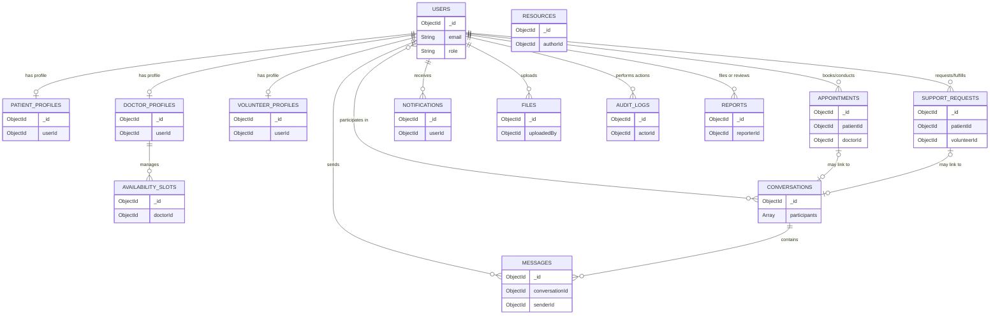

# Data Architecture Document: Ashwasa

This document outlines the data architecture, database strategy, and data model for the Ashwasa platform, a MongoDB-based healthcare support coordination system.

## 1. Database Strategy
- **Database Engine:** MongoDB 7.x hosted on MongoDB Atlas.
- **ORM/ODM:** Mongoose ODM with TypeScript for strict schema typing, validation, and middleware support.
- **Architecture:** Modular monolith — a single database instance with logical separation of domains by collection.

## 2. Data Model Overview

Below is the Entity-Relationship (ER) diagram mapping the core collections and their relationships.

## 3. Collection Design

### users
- **Purpose:** Core identity, authentication, and platform access.
- **Key Fields:**
  - `_id`: ObjectId
  - `email`: String, required, unique
  - `passwordHash`: String, required
  - `role`: Enum (PATIENT | FAMILY_MEMBER | DOCTOR | VOLUNTEER | ADMIN), required
  - `firstName`, `lastName`: String, required
  - `phone`, `city`, `zipCode`, `avatar`: String, optional
  - `emailVerified`: Boolean, default false
  - `verificationStatus`: Enum (NOT_REQUIRED | PENDING | APPROVED | REJECTED), required
  - `accountStatus`: Enum (ACTIVE | SUSPENDED | DELETED), required
  - `verificationToken`, `passwordResetToken`: String, optional
  - `passwordResetExpires`, `lockoutUntil`: Date, optional
  - `refreshTokenHash`: String, optional
  - `failedLoginAttempts`: Number, default 0
  - `notificationPreferences`: Embedded `{ emailMessages: boolean, emailAppointments: boolean }`
  - `createdAt`, `updatedAt`, `deletedAt`: Date
- **Relationships:** Referenced by almost all other collections.
- **Indexes:** 
  - `{ email: 1 }` (unique)
  - `{ role: 1, verificationStatus: 1 }`
  - `{ accountStatus: 1 }`
- **Sensitive Data Markers:** `passwordHash`, `refreshTokenHash`, `verificationToken`, `passwordResetToken`
- **Soft Delete:** Set `accountStatus` to DELETED and set `deletedAt`. PII is anonymized upon hard requirement.

### patient_profiles
- **Purpose:** Extended profile data specific to patients.
- **Key Fields:**
  - `_id`: ObjectId
  - `userId`: ObjectId, required (ref: users, unique)
  - `dateOfBirth`: Date, optional
  - `gender`: String, optional
  - `medicalNotes`: String, optional (basic text, not EHR)
  - `emergencyContact`: Embedded `{ name, phone, relationship }`, optional
  - `linkedFamilyMembers`: Array of `{ userId, inviteCode, linkedAt, status }`
- **Relationships:** Belongs to one User. Links to other Users (Family Members).
- **Indexes:** `{ userId: 1 }` (unique)
- **Sensitive Data Markers:** `dateOfBirth`, `medicalNotes`, `emergencyContact`

### doctor_profiles
- **Purpose:** Extended profile data specific to healthcare professionals.
- **Key Fields:**
  - `_id`: ObjectId
  - `userId`: ObjectId, required (ref: users, unique)
  - `specialty`, `licenseNumber`: String, required
  - `bio`, `qualifications`, `hospital`: String, optional
  - `yearsOfExperience`: Number, optional
  - `isAcceptingPatients`: Boolean, default true
  - `verificationDocuments`: Array of ObjectIds (ref: files)
- **Relationships:** Belongs to one User. Contains file references.
- **Indexes:** 
  - `{ userId: 1 }` (unique)
  - `{ specialty: 1, isAcceptingPatients: 1 }`

### volunteer_profiles
- **Purpose:** Extended profile data for support volunteers.
- **Key Fields:**
  - `_id`: ObjectId
  - `userId`: ObjectId, required (ref: users, unique)
  - `skills`: Array of Strings, optional
  - `bio`: String, optional
  - `availabilityPreferences`: Embedded object, optional
  - `verificationDocuments`: Array of ObjectIds (ref: files)
  - `totalTasksCompleted`: Number, default 0
- **Relationships:** Belongs to one User. Contains file references.
- **Indexes:** `{ userId: 1 }` (unique)

### appointments
- **Purpose:** Manages scheduling between patients and doctors.
- **Key Fields:**
  - `_id`: ObjectId
  - `patientId`: ObjectId, required (ref: users)
  - `doctorId`: ObjectId, required (ref: users)
  - `slotDate`: Date, required
  - `slotStartTime`, `slotEndTime`: String (time format), required
  - `status`: Enum (REQUESTED | ACCEPTED | REJECTED | CANCELLED | COMPLETED), required
  - `reason`: String, optional
  - `notes`: String, optional (doctor's internal note)
  - `conversationId`: ObjectId, optional (ref: conversations)
  - `cancelledBy`: ObjectId, optional (ref: users)
  - `cancellationReason`: String, optional
  - `createdAt`, `updatedAt`: Date
- **Relationships:** Links Patient and Doctor. Optionally links to a Conversation.
- **Indexes:** 
  - `{ patientId: 1, status: 1 }`
  - `{ doctorId: 1, status: 1 }`
  - `{ doctorId: 1, slotDate: 1 }`

### availability_slots
- **Purpose:** Stores doctor availability scheduling.
- **Key Fields:**
  - `_id`: ObjectId
  - `doctorId`: ObjectId, required (ref: users)
  - `date`: Date, required
  - `startTime`, `endTime`: String, required
  - `isBooked`: Boolean, default false
- **Relationships:** Links to a Doctor.
- **Indexes:** 
  - `{ doctorId: 1, date: 1 }`
  - `{ doctorId: 1, isBooked: 1, date: 1 }`

### support_requests
- **Purpose:** Job board items for non-clinical help fulfilled by volunteers.
- **Key Fields:**
  - `_id`: ObjectId
  - `patientId`: ObjectId, required (ref: users)
  - `createdById`: ObjectId, required (ref: users — could be patient or family member)
  - `title`, `description`: String, required
  - `category`: Enum (TRANSPORT | ERRANDS | COMPANIONSHIP | HOUSEHOLD | OTHER), required
  - `city`: String, optional
  - `status`: Enum (OPEN | ASSIGNED | IN_PROGRESS | COMPLETED | CANCELLED), required
  - `volunteerId`: ObjectId, optional (ref: users)
  - `conversationId`: ObjectId, optional (ref: conversations)
  - `assignedAt`, `completedAt`: Date, optional
  - `cancelledBy`: ObjectId, optional (ref: users)
  - `cancellationReason`: String, optional
  - `createdAt`, `updatedAt`: Date
- **Relationships:** Links Patient, Creator, and Volunteer. Optionally links to a Conversation.
- **Indexes:**
  - `{ status: 1, category: 1, city: 1 }`
  - `{ patientId: 1 }`
  - `{ volunteerId: 1 }`
  - `{ createdAt: -1 }`

### conversations
- **Purpose:** Chat threads between users (e.g., patient-doctor, patient-volunteer).
- **Key Fields:**
  - `_id`: ObjectId
  - `participants`: Array of ObjectIds (ref: users)
  - `linkedEntityType`: Enum (APPOINTMENT | SUPPORT_REQUEST | FAMILY), optional
  - `linkedEntityId`: ObjectId, optional
  - `status`: Enum (ACTIVE | CLOSED | ARCHIVED), required
  - `createdAt`, `updatedAt`: Date
- **Relationships:** Links multiple Users. Can polymorphically link to Appointments, Support Requests, etc.
- **Indexes:**
  - `{ participants: 1 }`
  - `{ linkedEntityType: 1, linkedEntityId: 1 }`

### messages
- **Purpose:** Individual chat messages inside a conversation.
- **Key Fields:**
  - `_id`: ObjectId
  - `conversationId`: ObjectId, required (ref: conversations)
  - `senderId`: ObjectId, required (ref: users)
  - `content`: String, required
  - `attachments`: Array of ObjectIds (ref: files), optional
  - `status`: Enum (SENT | DELIVERED | READ), required
  - `readAt`: Date, optional
  - `createdAt`: Date, required
- **Relationships:** Belongs to a Conversation and a Sender.
- **Indexes:**
  - `{ conversationId: 1, createdAt: 1 }`
  - `{ senderId: 1 }`
- **Sensitive Data Markers:** `content`

### notifications
- **Purpose:** System notifications to users.
- **Key Fields:**
  - `_id`: ObjectId
  - `userId`: ObjectId, required (ref: users)
  - `type`: Enum (APPOINTMENT_REQUESTED | APPOINTMENT_ACCEPTED | APPOINTMENT_REJECTED | NEW_MESSAGE | SUPPORT_REQUEST_ASSIGNED | USER_VERIFIED | USER_REJECTED | ACCOUNT_SUSPENDED), required
  - `title`, `body`: String, required
  - `linkedEntityType`, `linkedEntityId`: String/ObjectId, optional
  - `isRead`: Boolean, default false
  - `channel`: Enum (IN_APP | EMAIL), required
  - `status`: Enum (PENDING | SENT | FAILED), required
  - `createdAt`: Date
- **Relationships:** Belongs to a User.
- **Indexes:** `{ userId: 1, isRead: 1, createdAt: -1 }`

### resources
- **Purpose:** Knowledge base and educational articles.
- **Key Fields:**
  - `_id`: ObjectId
  - `title`: String, required
  - `content`: String (rich text/markdown), required
  - `category`: String, required
  - `tags`: Array of Strings, optional
  - `authorId`: ObjectId, required (ref: users — admin)
  - `status`: Enum (DRAFT | PUBLISHED | ARCHIVED), required
  - `createdAt`, `updatedAt`: Date
- **Relationships:** Authored by an Admin user.
- **Indexes:**
  - `{ status: 1, category: 1 }`
  - `{ title: 'text', content: 'text' }`

### files
- **Purpose:** Tracks all user-uploaded media/documents.
- **Key Fields:**
  - `_id`: ObjectId
  - `uploadedBy`: ObjectId, required (ref: users)
  - `originalName`, `mimeType`: String, required
  - `sizeBytes`: Number, required
  - `storageUrl`: String, required
  - `storageProvider`: Enum (CLOUDINARY | S3), required
  - `accessLevel`: Enum (PUBLIC | PRIVATE), required
  - `linkedEntityType`, `linkedEntityId`: String/ObjectId, optional
  - `createdAt`: Date
- **Relationships:** Owned by a User. Polymorphically links to entities (profiles, messages).
- **Indexes:**
  - `{ uploadedBy: 1 }`
  - `{ linkedEntityType: 1, linkedEntityId: 1 }`

### audit_logs
- **Purpose:** Immutable record of critical system actions.
- **Key Fields:**
  - `_id`: ObjectId
  - `action`: String, required
  - `actorId`: ObjectId, required (ref: users)
  - `targetId`, `targetType`: String/ObjectId, optional
  - `details`: Object, optional
  - `ipAddress`: String, required
  - `userAgent`: String, optional
  - `createdAt`: Date, required
- **Relationships:** Records the acting User.
- **Indexes:**
  - `{ actorId: 1, createdAt: -1 }`
  - `{ action: 1, createdAt: -1 }`
  - `{ targetId: 1, targetType: 1 }`
- **NOTE:** Audit logs are NEVER deleted or modified.

### reports
- **Purpose:** User-submitted reports for moderation.
- **Key Fields:**
  - `_id`: ObjectId
  - `reporterId`: ObjectId, required (ref: users)
  - `targetId`: ObjectId, required
  - `targetType`: Enum (USER | MESSAGE | SUPPORT_REQUEST), required
  - `reason`: String, required
  - `description`: String, optional
  - `status`: Enum (PENDING | REVIEWED | RESOLVED | DISMISSED), required
  - `reviewedBy`: ObjectId, optional (ref: users)
  - `reviewNotes`: String, optional
  - `createdAt`, `reviewedAt`: Date
- **Relationships:** Created by a User. Polymorphically targets entities. Reviewed by Admin.
- **Indexes:**
  - `{ status: 1, createdAt: -1 }`
  - `{ targetId: 1, targetType: 1 }`

## 4. Relationships Strategy
- **References over Embedding:** We heavily utilize ObjectId references for cross-collection relationships.
- **Embedded Documents:** Strictly reserved for small, bounded data (e.g., `emergencyContact`, `notificationPreferences`, `availabilityPreferences`).
- **Rationale:** References are easier to maintain, can be updated independently without cascading complex mutations, and guarantee we will not breach the MongoDB 16MB document size limit for highly interactive domains like messaging and notifications.

## 5. Index Strategy
- Create indexes that explicitly match the most common application query patterns.
- Leverage compound indexes for multi-field filtering/sorting queries.
- Implement text indexes (e.g., on `resources`) for full-text search functionality.
- Apply unique constraints via indexes for critical singletons like `email` or `userId` in profiles.
- Avoid over-indexing; each index incurs write performance and storage penalties. Keep indexes targeted.

## 6. Soft Deletion Strategy
- **Users:** Do not physically delete documents. Instead, set `accountStatus` to `DELETED` and append a `deletedAt` timestamp.
- **Anonymization:** For users requiring true deletion (GDPR/CCPA compliance), anonymize PII (e.g., change name to 'Deleted User', hash the email).
- **Audit Logs:** Permanently retain audit logs, regardless of user status.
- **Associations:** Keep associated support requests and appointments for historical metrics, but they will point to anonymized user references.

## 7. Data Ownership
- Each document in the system possesses a clear owner (e.g., `userId`, `patientId`, `doctorId`).
- This ownership drives application authorization: it determines who can Create, Read, Update, or Delete the document.
- Only users with the `ADMIN` role can override these ownership bounds for moderation, support, and administrative purposes.

## 8. Sensitive Data Boundaries
- Specific fields containing PII or health-adjacent data (e.g., `dateOfBirth`, `medicalNotes`, `emergencyContact`, `content` in messages) are strictly categorized as sensitive.
- **Logging Policy:** These fields must NEVER appear in server or application logs.
- **Access Control:** Reading these fields requires explicit role-based authorization scopes.
- **API Responses:** APIs must proactively strip/filter sensitive fields based on the requester's role and data ownership.

## 9. Data Retention Considerations
- The architecture aligns with data minimization principles — collect only what is necessary to facilitate support.
- Data retention periods will be defined per data type based on regulatory requirements and business needs.
- Stale data (e.g., expired verification tokens, old unread notifications, abandoned availability slots) will be aggressively cleared out via scheduled background jobs to optimize storage footprint.
