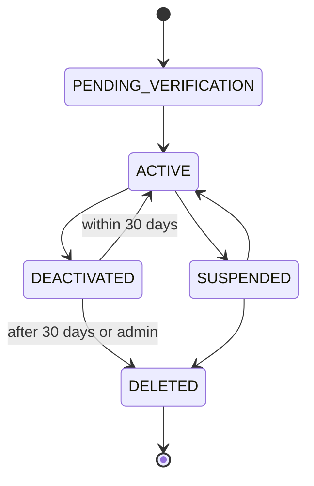
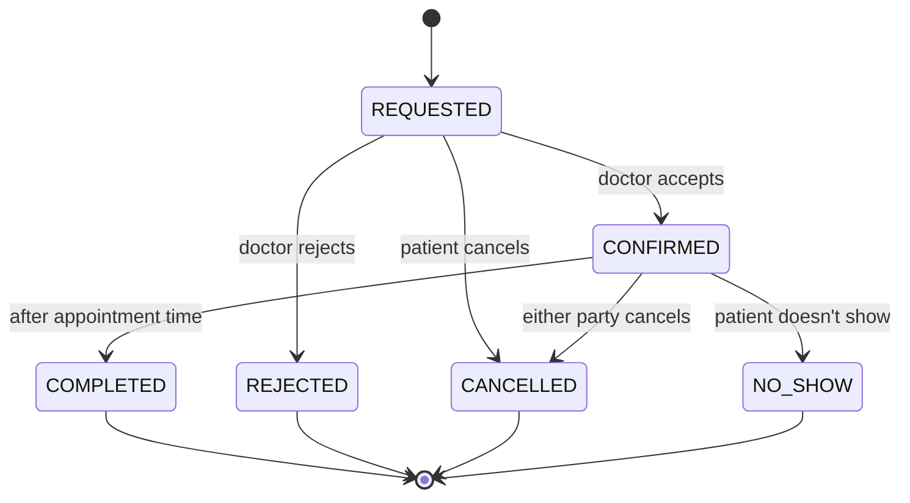
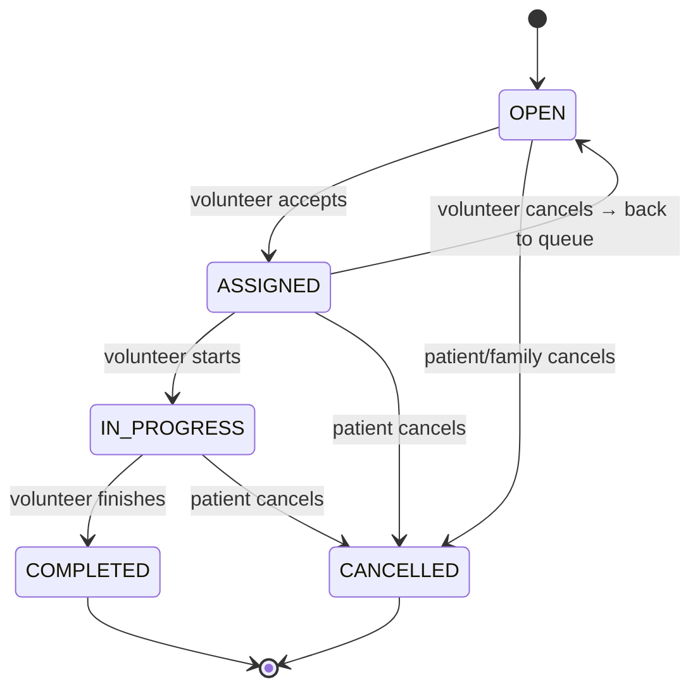
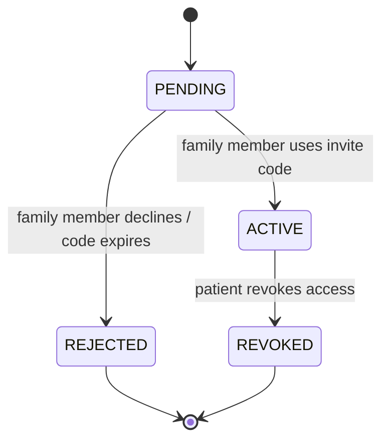
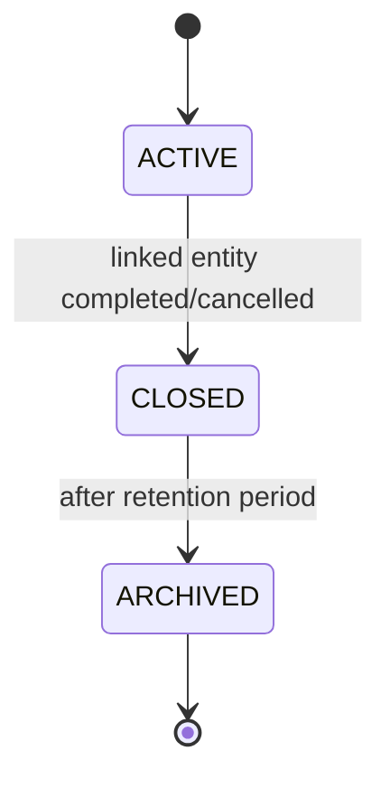

# Data Lifecycle & Architecture

This document describes the data lifecycle, states, retention policies, privacy architecture, and backup strategies for Ashwasa.

## 1. State Machine Diagrams

### User Account States

### Appointment States

### Support Request States

### Family Relationship States

### Conversation States

## 2. Data Retention Policy

| Data Type | Active Retention | After Deletion | Notes |
|---|---|---|---|
| User accounts | Indefinite while active | PII anonymized, record kept 90 days then hard delete | Audit logs preserved |
| Patient profiles | While user active | Anonymized with user | Sensitive fields cleared |
| Appointments | Indefinite | Retained (anonymized user refs) | Historical analytics |
| Support requests | Indefinite | Retained (anonymized user refs) | Historical analytics |
| Messages | While participants active | Retained for 90 days after last participant deletion | Content may be redacted |
| Notifications | 90 days | Auto-deleted after 90 days | Reduces storage |
| Files (avatars) | While user active | Deleted from cloud storage | Metadata retained briefly |
| Files (verification docs) | While user active | Deleted from cloud storage | Metadata retained for audit |
| Audit logs | PERMANENT | NEVER deleted | Compliance requirement |
| Unverified accounts | 30 days | Hard deleted | Cleanup cron job |
| Expired tokens | 24 hours past expiry | Hard deleted | Cleanup cron job |

## 3. Privacy Architecture

| Data | Purpose | Sensitivity | Who Can Access | Retention | Deletion Behavior |
|---|---|---|---|---|---|
| email | Authentication, communication | INTERNAL | Self, Admin | While active | Anonymized on delete |
| password_hash | Authentication | RESTRICTED | System only | While active | Deleted on delete |
| first_name, last_name | Identification | INTERNAL | Self, connected users, Admin | While active | Anonymized on delete |
| date_of_birth | Patient context | CONFIDENTIAL | Self, Admin | While active | Cleared on delete |
| medical_notes | Patient context | CONFIDENTIAL | Self, Doctor (active appt), Admin | While active | Cleared on delete |
| emergency_contact | Safety | CONFIDENTIAL | Self, Admin | While active | Cleared on delete |
| message content | Communication | CONFIDENTIAL | Conversation participants | 90 days post-deletion | Redacted |
| verification documents | Trust & safety | CONFIDENTIAL | Self, Admin | While active | Deleted from storage |
| IP address (audit) | Security | INTERNAL | Admin | Permanent | Never deleted |

## 4. Backup & Recovery
- PostgreSQL: Daily automated backups (Supabase/Neon built-in)
- Backup encryption: AES-256 at rest
- Point-in-time recovery: Up to 7 days (Supabase Pro) or 30 days
- RPO (Recovery Point Objective): 1 hour (acceptable for MVP)
- RTO (Recovery Time Objective): 4 hours (acceptable for MVP)
- Restore testing: Monthly manual test recommended
- Disaster recovery: Multi-region replication available on paid tiers

## 5. Migration Strategy
- Prisma Migrate for versioned, reproducible schema migrations
- `prisma migrate dev` for development
- `prisma migrate deploy` for production (non-interactive)
- Backward compatibility: Never drop columns in production without deprecation period
- Rollback: Prisma supports migration rollback; always test migrations on staging first
- Data migrations: Use Prisma's seed scripts or custom migration scripts

## 6. Seed Data Strategy
Define seed data for development/demo:
- 1 Admin user (admin@ashwasasupport.dev)
- 2 Doctors (verified, with availability slots)
- 3 Patients (with profiles)
- 2 Family Members (linked to patients)
- 2 Volunteers (verified)
- 5 Sample appointments (various statuses)
- 5 Sample support requests (various statuses)
- 3 Sample resources (published)
- Sample conversations with messages
- ALL seed data must be obviously fictional
