# Ashwasa - Database Design

## 1. Database Overview
- **Database**: PostgreSQL 16 (hosted on Supabase, Neon, or Railway Postgres)
- **ORM**: Prisma (type-safe, auto-generated migrations, excellent TypeScript + NestJS integration)
- **Architecture**: Single database, logical separation by domain
- **Primary Keys**: UUID (using `gen_random_uuid()`)

## 2. PostgreSQL Enums

Define all enums used across tables:

```sql
CREATE TYPE user_role AS ENUM ('PATIENT', 'FAMILY_MEMBER', 'DOCTOR', 'VOLUNTEER', 'ADMIN');
CREATE TYPE account_status AS ENUM ('PENDING_VERIFICATION', 'ACTIVE', 'SUSPENDED', 'DEACTIVATED', 'DELETED');
CREATE TYPE verification_status AS ENUM ('NOT_REQUIRED', 'PENDING', 'APPROVED', 'REJECTED');
CREATE TYPE appointment_status AS ENUM ('REQUESTED', 'CONFIRMED', 'REJECTED', 'CANCELLED', 'COMPLETED', 'NO_SHOW');
CREATE TYPE support_request_status AS ENUM ('OPEN', 'ASSIGNED', 'IN_PROGRESS', 'COMPLETED', 'CANCELLED');
CREATE TYPE support_request_category AS ENUM ('TRANSPORT', 'ERRANDS', 'COMPANIONSHIP', 'HOUSEHOLD', 'OTHER');
CREATE TYPE family_relationship_status AS ENUM ('PENDING', 'ACTIVE', 'REJECTED', 'REVOKED');
CREATE TYPE conversation_status AS ENUM ('ACTIVE', 'CLOSED', 'ARCHIVED');
CREATE TYPE conversation_context_type AS ENUM ('APPOINTMENT', 'SUPPORT_REQUEST', 'FAMILY');
CREATE TYPE message_status AS ENUM ('SENT', 'DELIVERED', 'READ');
CREATE TYPE notification_type AS ENUM ('APPOINTMENT_REQUESTED', 'APPOINTMENT_CONFIRMED', 'APPOINTMENT_REJECTED', 'APPOINTMENT_CANCELLED', 'NEW_MESSAGE', 'SUPPORT_REQUEST_ASSIGNED', 'SUPPORT_REQUEST_COMPLETED', 'USER_VERIFIED', 'USER_REJECTED', 'ACCOUNT_SUSPENDED');
CREATE TYPE notification_channel AS ENUM ('IN_APP', 'EMAIL');
CREATE TYPE notification_delivery_status AS ENUM ('PENDING', 'SENT', 'FAILED');
CREATE TYPE resource_status AS ENUM ('DRAFT', 'PUBLISHED', 'ARCHIVED');
CREATE TYPE file_access_level AS ENUM ('PUBLIC', 'PRIVATE');
CREATE TYPE file_status AS ENUM ('UPLOADING', 'AVAILABLE', 'QUARANTINED', 'DELETED');
CREATE TYPE report_status AS ENUM ('PENDING', 'REVIEWED', 'RESOLVED', 'DISMISSED');
CREATE TYPE report_target_type AS ENUM ('USER', 'MESSAGE', 'SUPPORT_REQUEST');
CREATE TYPE audit_action AS ENUM ('LOGIN', 'LOGOUT', 'LOGIN_FAILED', 'PASSWORD_CHANGED', 'PASSWORD_RESET_REQUESTED', 'PROFILE_UPDATED', 'ACCOUNT_STATUS_CHANGED', 'VERIFICATION_STATUS_CHANGED', 'APPOINTMENT_CREATED', 'APPOINTMENT_STATUS_CHANGED', 'SUPPORT_REQUEST_CREATED', 'SUPPORT_REQUEST_STATUS_CHANGED', 'MESSAGE_SENT', 'FILE_UPLOADED', 'FILE_ACCESSED', 'REPORT_CREATED', 'REPORT_REVIEWED', 'ADMIN_ACTION');
```

## 3. Table Designs

### users
* **Purpose**: Core authentication and identity table.
* **Columns**:
  * `id`: UUID PK DEFAULT gen_random_uuid()
  * `email`: VARCHAR(255) NOT NULL UNIQUE
  * `password_hash`: VARCHAR(255) NOT NULL
  * `role`: user_role NOT NULL
  * `first_name`: VARCHAR(100) NOT NULL
  * `last_name`: VARCHAR(100) NOT NULL
  * `phone`: VARCHAR(20) NULL
  * `city`: VARCHAR(100) NULL
  * `zip_code`: VARCHAR(20) NULL
  * `avatar_url`: TEXT NULL
  * `email_verified`: BOOLEAN NOT NULL DEFAULT FALSE
  * `account_status`: account_status NOT NULL DEFAULT 'PENDING_VERIFICATION'
  * `verification_status`: verification_status NOT NULL DEFAULT 'NOT_REQUIRED'
  * `email_verification_token`: VARCHAR(255) NULL
  * `email_verification_expires`: TIMESTAMPTZ NULL
  * `password_reset_token`: VARCHAR(255) NULL
  * `password_reset_expires`: TIMESTAMPTZ NULL
  * `refresh_token_hash`: VARCHAR(255) NULL
  * `failed_login_attempts`: INTEGER NOT NULL DEFAULT 0
  * `lockout_until`: TIMESTAMPTZ NULL
  * `email_notifications_enabled`: BOOLEAN NOT NULL DEFAULT TRUE
  * `last_login_at`: TIMESTAMPTZ NULL
  * `created_at`: TIMESTAMPTZ NOT NULL DEFAULT NOW()
  * `updated_at`: TIMESTAMPTZ NOT NULL DEFAULT NOW()
  * `deleted_at`: TIMESTAMPTZ NULL
* **Indexes**: email (unique), role + verification_status, account_status
* **Sensitive**: password_hash, refresh_token_hash, email_verification_token, password_reset_token

### patient_profiles
* **Purpose**: Stores specific medical and emergency details for patients.
* **Columns**:
  * `id`: UUID PK DEFAULT gen_random_uuid()
  * `user_id`: UUID NOT NULL UNIQUE REFERENCES users(id) ON DELETE CASCADE
  * `date_of_birth`: DATE NULL
  * `gender`: VARCHAR(20) NULL
  * `medical_notes`: TEXT NULL
  * `emergency_contact_name`: VARCHAR(100) NULL
  * `emergency_contact_phone`: VARCHAR(20) NULL
  * `emergency_contact_relationship`: VARCHAR(50) NULL
  * `created_at`: TIMESTAMPTZ NOT NULL DEFAULT NOW()
  * `updated_at`: TIMESTAMPTZ NOT NULL DEFAULT NOW()
* **FKs**: `user_id` → `users(id)` ON DELETE CASCADE
* **Sensitive**: date_of_birth, medical_notes, emergency_contact_*

### doctor_profiles
* **Purpose**: Professional and practice details for doctors.
* **Columns**:
  * `id`: UUID PK DEFAULT gen_random_uuid()
  * `user_id`: UUID NOT NULL UNIQUE REFERENCES users(id) ON DELETE CASCADE
  * `specialty`: VARCHAR(100) NOT NULL
  * `license_number`: VARCHAR(100) NOT NULL
  * `bio`: TEXT NULL
  * `qualifications`: TEXT NULL
  * `hospital`: VARCHAR(200) NULL
  * `years_of_experience`: INTEGER NULL
  * `is_accepting_patients`: BOOLEAN NOT NULL DEFAULT TRUE
  * `created_at`: TIMESTAMPTZ NOT NULL DEFAULT NOW()
  * `updated_at`: TIMESTAMPTZ NOT NULL DEFAULT NOW()
* **FKs**: `user_id` → `users(id)` ON DELETE CASCADE
* **Indexes**: specialty + is_accepting_patients

### volunteer_profiles
* **Purpose**: Details for volunteers facilitating support requests.
* **Columns**:
  * `id`: UUID PK DEFAULT gen_random_uuid()
  * `user_id`: UUID NOT NULL UNIQUE REFERENCES users(id) ON DELETE CASCADE
  * `skills`: TEXT[] NULL
  * `bio`: TEXT NULL
  * `total_tasks_completed`: INTEGER NOT NULL DEFAULT 0
  * `created_at`: TIMESTAMPTZ NOT NULL DEFAULT NOW()
  * `updated_at`: TIMESTAMPTZ NOT NULL DEFAULT NOW()
* **FKs**: `user_id` → `users(id)` ON DELETE CASCADE

### family_relationships
* **Purpose**: Tracks links between patients and their family members.
* **Columns**:
  * `id`: UUID PK DEFAULT gen_random_uuid()
  * `patient_id`: UUID NOT NULL REFERENCES users(id) ON DELETE CASCADE
  * `family_member_id`: UUID NOT NULL REFERENCES users(id) ON DELETE CASCADE
  * `invite_code`: VARCHAR(20) NOT NULL UNIQUE
  * `relationship_type`: VARCHAR(50) NULL
  * `status`: family_relationship_status NOT NULL DEFAULT 'PENDING'
  * `initiated_by`: UUID NOT NULL REFERENCES users(id)
  * `linked_at`: TIMESTAMPTZ NULL
  * `revoked_at`: TIMESTAMPTZ NULL
  * `created_at`: TIMESTAMPTZ NOT NULL DEFAULT NOW()
  * `updated_at`: TIMESTAMPTZ NOT NULL DEFAULT NOW()
* **FKs**: `patient_id` → `users`, `family_member_id` → `users`, `initiated_by` → `users`
* **Unique Constraints**: (`patient_id`, `family_member_id`)
* **Indexes**: patient_id, family_member_id, invite_code (unique), status

### availability_slots
* **Purpose**: Calendar slots defined by doctors for appointments.
* **Columns**:
  * `id`: UUID PK DEFAULT gen_random_uuid()
  * `doctor_id`: UUID NOT NULL REFERENCES users(id) ON DELETE CASCADE
  * `slot_date`: DATE NOT NULL
  * `start_time`: TIME NOT NULL
  * `end_time`: TIME NOT NULL
  * `is_booked`: BOOLEAN NOT NULL DEFAULT FALSE
  * `created_at`: TIMESTAMPTZ NOT NULL DEFAULT NOW()
* **FKs**: `doctor_id` → `users(id)`
* **Unique/Check Constraints**: No overlapping slots for same doctor on same date
* **Indexes**: doctor_id + slot_date, doctor_id + is_booked + slot_date

### appointments
* **Purpose**: Logs scheduled meetings between patients and doctors.
* **Columns**:
  * `id`: UUID PK DEFAULT gen_random_uuid()
  * `patient_id`: UUID NOT NULL REFERENCES users(id) ON DELETE CASCADE
  * `doctor_id`: UUID NOT NULL REFERENCES users(id) ON DELETE CASCADE
  * `slot_id`: UUID NULL REFERENCES availability_slots(id) ON DELETE SET NULL
  * `scheduled_date`: DATE NOT NULL
  * `start_time`: TIME NOT NULL
  * `end_time`: TIME NOT NULL
  * `timezone`: VARCHAR(50) NOT NULL DEFAULT 'UTC'
  * `status`: appointment_status NOT NULL DEFAULT 'REQUESTED'
  * `reason`: TEXT NULL
  * `notes`: TEXT NULL
  * `conversation_id`: UUID NULL REFERENCES conversations(id) ON DELETE SET NULL
  * `cancelled_by`: UUID NULL REFERENCES users(id)
  * `cancellation_reason`: TEXT NULL
  * `completed_at`: TIMESTAMPTZ NULL
  * `created_at`: TIMESTAMPTZ NOT NULL DEFAULT NOW()
  * `updated_at`: TIMESTAMPTZ NOT NULL DEFAULT NOW()
* **FKs**: `patient_id` → `users`, `doctor_id` → `users`, `slot_id` → `availability_slots`, `cancelled_by` → `users`, `conversation_id` → `conversations`
* **Indexes**: patient_id + status, doctor_id + status, doctor_id + scheduled_date + start_time
* **Check Constraints**: Status transitions verified by app
* **Sensitive**: notes

### support_requests
* **Purpose**: Non-medical assistance requests managed by volunteers.
* **Columns**:
  * `id`: UUID PK DEFAULT gen_random_uuid()
  * `patient_id`: UUID NOT NULL REFERENCES users(id) ON DELETE CASCADE
  * `created_by_id`: UUID NOT NULL REFERENCES users(id) ON DELETE CASCADE
  * `title`: VARCHAR(200) NOT NULL
  * `description`: TEXT NOT NULL
  * `category`: support_request_category NOT NULL
  * `city`: VARCHAR(100) NULL
  * `status`: support_request_status NOT NULL DEFAULT 'OPEN'
  * `volunteer_id`: UUID NULL REFERENCES users(id) ON DELETE SET NULL
  * `conversation_id`: UUID NULL REFERENCES conversations(id) ON DELETE SET NULL
  * `assigned_at`: TIMESTAMPTZ NULL
  * `completed_at`: TIMESTAMPTZ NULL
  * `cancelled_by`: UUID NULL REFERENCES users(id)
  * `cancellation_reason`: TEXT NULL
  * `created_at`: TIMESTAMPTZ NOT NULL DEFAULT NOW()
  * `updated_at`: TIMESTAMPTZ NOT NULL DEFAULT NOW()
* **FKs**: `patient_id` → `users`, `created_by_id` → `users`, `volunteer_id` → `users`, `cancelled_by` → `users`, `conversation_id` → `conversations`
* **Indexes**: status + category + city, patient_id, volunteer_id, created_at DESC

### conversations
* **Purpose**: Thread tracking for chat functionality across different features.
* **Columns**:
  * `id`: UUID PK DEFAULT gen_random_uuid()
  * `context_type`: conversation_context_type NOT NULL
  * `context_id`: UUID NOT NULL
  * `status`: conversation_status NOT NULL DEFAULT 'ACTIVE'
  * `created_at`: TIMESTAMPTZ NOT NULL DEFAULT NOW()
  * `updated_at`: TIMESTAMPTZ NOT NULL DEFAULT NOW()
* **Indexes**: context_type + context_id

### conversation_participants
* **Purpose**: Maps users to conversation threads.
* **Columns**:
  * `id`: UUID PK DEFAULT gen_random_uuid()
  * `conversation_id`: UUID NOT NULL REFERENCES conversations(id) ON DELETE CASCADE
  * `user_id`: UUID NOT NULL REFERENCES users(id) ON DELETE CASCADE
  * `joined_at`: TIMESTAMPTZ NOT NULL DEFAULT NOW()
  * `left_at`: TIMESTAMPTZ NULL
* **FKs**: `conversation_id` → `conversations`, `user_id` → `users`
* **Unique Constraints**: (`conversation_id`, `user_id`)
* **Indexes**: user_id

### messages
* **Purpose**: Individual text messages within conversations.
* **Columns**:
  * `id`: UUID PK DEFAULT gen_random_uuid()
  * `conversation_id`: UUID NOT NULL REFERENCES conversations(id) ON DELETE CASCADE
  * `sender_id`: UUID NOT NULL REFERENCES users(id) ON DELETE CASCADE
  * `content`: TEXT NOT NULL
  * `status`: message_status NOT NULL DEFAULT 'SENT'
  * `read_at`: TIMESTAMPTZ NULL
  * `created_at`: TIMESTAMPTZ NOT NULL DEFAULT NOW()
* **FKs**: `conversation_id` → `conversations`, `sender_id` → `users`
* **Indexes**: conversation_id + created_at, sender_id
* **Sensitive**: content

### notifications
* **Purpose**: User alert event tracking.
* **Columns**:
  * `id`: UUID PK DEFAULT gen_random_uuid()
  * `user_id`: UUID NOT NULL REFERENCES users(id) ON DELETE CASCADE
  * `type`: notification_type NOT NULL
  * `title`: VARCHAR(200) NOT NULL
  * `body`: TEXT NOT NULL
  * `linked_entity_type`: VARCHAR(50) NULL
  * `linked_entity_id`: UUID NULL
  * `is_read`: BOOLEAN NOT NULL DEFAULT FALSE
  * `channel`: notification_channel NOT NULL DEFAULT 'IN_APP'
  * `delivery_status`: notification_delivery_status NOT NULL DEFAULT 'PENDING'
  * `created_at`: TIMESTAMPTZ NOT NULL DEFAULT NOW()
* **FKs**: `user_id` → `users(id)` ON DELETE CASCADE
* **Indexes**: user_id + is_read + created_at DESC

### resources
* **Purpose**: Educational or helpful articles for users.
* **Columns**:
  * `id`: UUID PK DEFAULT gen_random_uuid()
  * `title`: VARCHAR(200) NOT NULL
  * `content`: TEXT NOT NULL
  * `category`: VARCHAR(100) NOT NULL
  * `tags`: TEXT[] NULL
  * `author_id`: UUID NOT NULL REFERENCES users(id) ON DELETE CASCADE
  * `status`: resource_status NOT NULL DEFAULT 'DRAFT'
  * `created_at`: TIMESTAMPTZ NOT NULL DEFAULT NOW()
  * `updated_at`: TIMESTAMPTZ NOT NULL DEFAULT NOW()
* **FKs**: `author_id` → `users(id)`
* **Indexes**: status + category, GIN index on title

### files
* **Purpose**: Tracks uploads in the system.
* **Columns**:
  * `id`: UUID PK DEFAULT gen_random_uuid()
  * `uploaded_by`: UUID NOT NULL REFERENCES users(id) ON DELETE CASCADE
  * `original_name`: VARCHAR(255) NOT NULL
  * `mime_type`: VARCHAR(100) NOT NULL
  * `size_bytes`: INTEGER NOT NULL
  * `storage_url`: TEXT NOT NULL
  * `storage_provider`: VARCHAR(50) NOT NULL DEFAULT 'CLOUDINARY'
  * `access_level`: file_access_level NOT NULL DEFAULT 'PRIVATE'
  * `status`: file_status NOT NULL DEFAULT 'AVAILABLE'
  * `linked_entity_type`: VARCHAR(50) NULL
  * `linked_entity_id`: UUID NULL
  * `created_at`: TIMESTAMPTZ NOT NULL DEFAULT NOW()
  * `deleted_at`: TIMESTAMPTZ NULL
* **FKs**: `uploaded_by` → `users(id)`
* **Indexes**: uploaded_by, linked_entity_type + linked_entity_id

### audit_logs
* **Purpose**: Security and activity log for sensitive operations.
* **Columns**:
  * `id`: UUID PK DEFAULT gen_random_uuid()
  * `action`: audit_action NOT NULL
  * `actor_id`: UUID NOT NULL REFERENCES users(id) ON DELETE CASCADE
  * `target_id`: UUID NULL
  * `target_type`: VARCHAR(50) NULL
  * `details`: JSONB NULL
  * `ip_address`: INET NULL
  * `user_agent`: TEXT NULL
  * `created_at`: TIMESTAMPTZ NOT NULL DEFAULT NOW()
* **FKs**: `actor_id` → `users(id)`
* **Indexes**: actor_id + created_at DESC, action + created_at DESC, target_id + target_type
* **Note**: INSERT-only

### reports
* **Purpose**: Moderation and dispute tracking.
* **Columns**:
  * `id`: UUID PK DEFAULT gen_random_uuid()
  * `reporter_id`: UUID NOT NULL REFERENCES users(id) ON DELETE CASCADE
  * `target_id`: UUID NOT NULL
  * `target_type`: report_target_type NOT NULL
  * `reason`: VARCHAR(500) NOT NULL
  * `description`: TEXT NULL
  * `status`: report_status NOT NULL DEFAULT 'PENDING'
  * `reviewed_by`: UUID NULL REFERENCES users(id)
  * `review_notes`: TEXT NULL
  * `created_at`: TIMESTAMPTZ NOT NULL DEFAULT NOW()
  * `reviewed_at`: TIMESTAMPTZ NULL
* **FKs**: `reporter_id` → `users`, `reviewed_by` → `users`
* **Indexes**: status + created_at DESC, target_id + target_type

## 4. Entity Relationship Diagram

```mermaid
erDiagram
    users ||--o| patient_profiles : "has"
    users ||--o| doctor_profiles : "has"
    users ||--o| volunteer_profiles : "has"
    
    users ||--o{ family_relationships : "patient"
    users ||--o{ family_relationships : "family_member"
    users ||--o{ family_relationships : "initiated_by"
    
    users ||--o{ availability_slots : "doctor"
    
    users ||--o{ appointments : "patient"
    users ||--o{ appointments : "doctor"
    users ||--o{ appointments : "cancelled_by"
    availability_slots ||--o| appointments : "books"
    
    users ||--o{ support_requests : "patient"
    users ||--o{ support_requests : "created_by"
    users ||--o{ support_requests : "volunteer"
    users ||--o{ support_requests : "cancelled_by"
    
    conversations ||--o{ conversation_participants : "has"
    users ||--o{ conversation_participants : "participates_in"
    
    conversations ||--o{ messages : "contains"
    users ||--o{ messages : "sends"
    
    conversations |o--o| appointments : "linked_to"
    conversations |o--o| support_requests : "linked_to"
    
    users ||--o{ notifications : "receives"
    
    users ||--o{ resources : "authors"
    
    users ||--o{ files : "uploads"
    
    users ||--o{ audit_logs : "acts"
    
    users ||--o{ reports : "reports"
    users ||--o{ reports : "reviews"
```



## 5. Data Integrity Rules

- **UNIQUE constraints**: `email`, `user_id` in profiles, (`patient_id`, `family_member_id`) in family_relationships, `invite_code`
- **FK constraints**: Use appropriate ON DELETE behavior (`CASCADE` for owned data like profiles and messages, `SET NULL` for loose references like cancelled_by or conversational context).
- **Application-level validation**: Enforce state machine transitions (e.g., appointment CANCELLED -> COMPLETED is invalid).
- **Concurrent access**: Use `SELECT FOR UPDATE` or optimistic locking (version column) for highly concurrent states such as volunteer task acceptance.
- **No orphaned records**: Ensured systematically thanks to strictly typed foreign key constraints.

## 6. Soft Deletion Strategy

- **Users**: Set `account_status = 'DELETED'`, set `deleted_at`, anonymize PII.
- **Files**: Set `status = 'DELETED'`, set `deleted_at`, remove from cloud storage.
- **Messages/Conversations**: NOT soft-deleted (retained for audit and historical purposes).
- **Audit logs**: NEVER deleted (immutable history).
