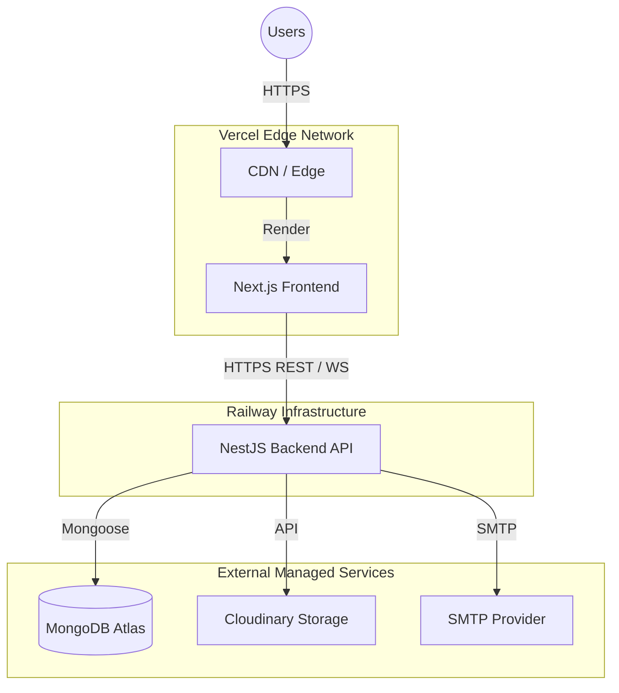
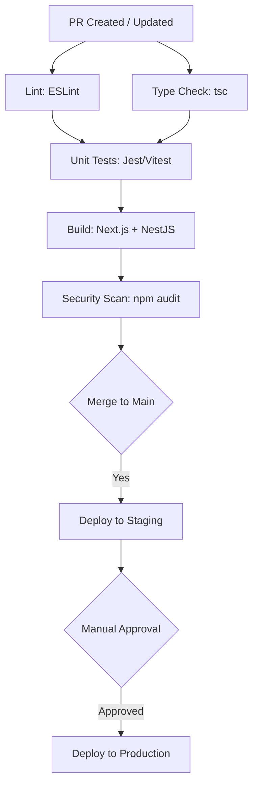

# Deployment Architecture

This document describes the deployment architecture and infrastructure for the Ashwasa platform.

## 1. Deployment Overview

The Ashwasa platform utilizes a modern, serverless-friendly cloud architecture, separating the frontend and backend deployments for optimal scaling and developer experience.

## 2. Frontend Deployment (Vercel)

The Next.js frontend is deployed on Vercel, which provides out-of-the-box optimization for Next.js applications.

*   **Platform:** Vercel
*   **Workflow:** Auto-deploy from Git (main branch)
*   **Preview Environments:** Automatic preview deployments for every Pull Request
*   **Edge Network:** Global CDN delivery for fast static asset loading
*   **Configuration:** Environment variables managed via the Vercel dashboard
*   **Domain:** Custom domain setup with automatic SSL/TLS
*   **Rendering:** Combination of SSR for dynamic content and ISR/SSG for static resources (e.g., public pages).

## 3. Backend Deployment (Railway)

The NestJS backend API is deployed on Railway, providing a reliable and easily configurable platform for Node.js applications.

*   **Platform:** Railway
*   **Deployment Method:** Docker-based deployment using a multi-stage Dockerfile optimized for Node.js/NestJS.
*   **Health Checks:** `GET /api/v1/health` endpoint configured to ensure service availability.
*   **Resilience:** Auto-restart on failure.
*   **Observability:** Built-in logging and metrics via the Railway dashboard.
*   **Configuration:** Environment variables managed securely in Railway.
*   **Domain:** Custom domain mapped for the API (e.g., `api.ashwasasupport.com`).

## 4. Database Deployment (MongoDB Atlas)

We use MongoDB Atlas for a fully managed, secure, and highly available database solution.

*   **Service:** MongoDB Atlas managed cluster
*   **Tiers:**
    *   Development: M0 (Free Tier)
    *   Staging: M0 or M2
    *   Production: M10+ (Dedicated cluster)
*   **Backups:** Automated daily backups enabled with point-in-time recovery.
*   **Security:** Network access restricted by whitelisting Railway's egress IPs.
*   **Configuration:** Connection string securely passed via the `DATABASE_URL` environment variable.
*   **Observability:** Comprehensive monitoring via the Atlas dashboard.

## 5. File Storage (Cloudinary)

Cloudinary handles all file and image storage, optimization, and delivery.

*   **Capabilities:** Cloud-based image and file management.
*   **Performance:** Automatic image optimization, transformations, and global CDN delivery.
*   **Security:**
    *   Signed URLs for accessing private files.
    *   Upload presets configured to restrict upload types and sizes.

## 6. Email Service

Transactional emails are handled by a dedicated SMTP provider (e.g., SendGrid, Mailgun, or Resend).

*   **Use Cases:** Verification emails, password resets, system notifications.
*   **Configuration:** Environment-specific SMTP credentials configured in the backend.

## 7. Environment Strategy

We maintain isolated environments for development, testing, and production.

| Environment | Frontend | Backend | Database | Purpose |
| :--- | :--- | :--- | :--- | :--- |
| **Development** | `localhost:3000` | `localhost:3001` | Atlas M0 (dev) | Local development |
| **Staging** | Vercel preview URLs | Railway staging env | Atlas M0 (staging) | Pre-production testing |
| **Production** | Vercel production | Railway production | Atlas M10+ (prod) | Live users |

## 8. CI/CD Pipeline

The Continuous Integration and Continuous Deployment pipeline is managed via GitHub Actions.

## 9. Environment Variables

The following environment variables are required across the different services.

### Backend (`.env`)

*   `NODE_ENV`: (e.g., development, staging, production)
*   `PORT`: API port (default: 3001)
*   `DATABASE_URL`: MongoDB connection string
*   `JWT_SECRET`: Secret for access tokens
*   `JWT_REFRESH_SECRET`: Secret for refresh tokens
*   `JWT_ACCESS_EXPIRY`: (e.g., 15m)
*   `JWT_REFRESH_EXPIRY`: (e.g., 7d)
*   `SMTP_HOST`: Email server host
*   `SMTP_PORT`: Email server port
*   `SMTP_USER`: SMTP username
*   `SMTP_PASS`: SMTP password
*   `SMTP_FROM`: Default sender address
*   `CLOUDINARY_CLOUD_NAME`: Cloudinary identifier
*   `CLOUDINARY_API_KEY`: Cloudinary API key
*   `CLOUDINARY_API_SECRET`: Cloudinary API secret
*   `FRONTEND_URL`: URL of the frontend for CORS and links
*   `CORS_ORIGIN`: Allowed origins for CORS

### Frontend (`.env.local`)

*   `NEXT_PUBLIC_API_URL`: Backend API URL
*   `NEXT_PUBLIC_WS_URL`: Backend WebSocket URL
*   `NEXT_PUBLIC_APP_NAME`: Application name

## 10. Domain & DNS

*   **Frontend:** `app.ashwasasupport.com` → CNAME to Vercel
*   **Backend API:** `api.ashwasasupport.com` → CNAME to Railway
*   **DNS:** Standard CNAME records configuration handled at the domain registrar.

## 11. Monitoring & Alerting

*   **Frontend:** Vercel analytics for core web vitals and frontend performance.
*   **Backend:** Railway metrics for CPU, memory usage, and request tracking.
*   **Database:** MongoDB Atlas monitoring for connections, query performance, and storage metrics.
*   **Uptime:** External uptime monitoring (e.g., UptimeRobot, Better Uptime) pinging the health check endpoint.
*   **Alerting:** Alerts configured to notify the admin team via Email/Slack on downtime or high error rates.

## 12. Backup & Recovery

*   **Database (MongoDB Atlas):** Automated daily backups with point-in-time recovery capabilities.
*   **File Storage (Cloudinary):** Built-in redundancy and multi-region backups provided by the vendor.
*   **Codebase:** Git history on GitHub acts as the single source of truth.
*   **Procedures:** Recovery procedures (e.g., DB restoration) are documented in the operations manual.

## 13. Security in Deployment

*   **Transport Security:** HTTPS enforced everywhere by Vercel and Railway.
*   **Secrets Management:** Environment variables used for all secrets; never committed to version control.
*   **Database Security:** MongoDB Atlas network access restricted; strong authentication required.
*   **File Security:** Cloudinary configured to use signed uploads for protected assets.
*   **API Security:** CORS configured strictly to allow only the specified frontend origin; NestJS Helmet middleware employed to set secure HTTP headers.

## 14. Scaling Plan

*   **Frontend (Vercel):** Inherently scalable due to edge network and serverless functions.
*   **Backend (Railway):**
    *   Vertical Scaling: Upgrade instance plans (CPU/RAM).
    *   Horizontal Scaling: Deploy multiple instances.
*   **Database (MongoDB Atlas):** Scale up to higher cluster tiers (M20, M30) or add read replicas to distribute query load.
*   **WebSockets:** When scaling backend horizontally, implement a Redis adapter (e.g., `@nestjs/platform-socket.io` with Redis) to handle cross-node event broadcasting and sticky sessions.

## 15. Cost Estimation

Estimated monthly costs for the MVP launch phase:

*   **Vercel (Frontend):** Free tier (Hobby) or Pro ($20/mo)
*   **Railway (Backend):** Starter ($5/mo) or Developer ($10/mo)
*   **MongoDB Atlas (Database):** M0 free → M10 ($57/mo for production)
*   **Cloudinary (Storage):** Free tier (generous 25GB limit)
*   **Email (SMTP):** Free tier (most providers offer 100-300 emails/day free)

**Total MVP Estimate:** $0 - $92/month
