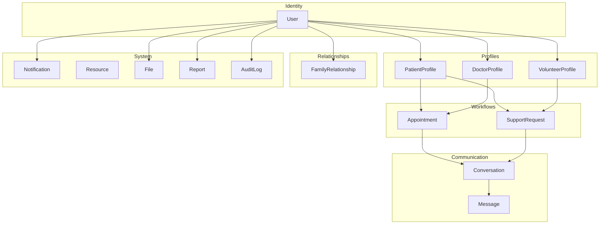
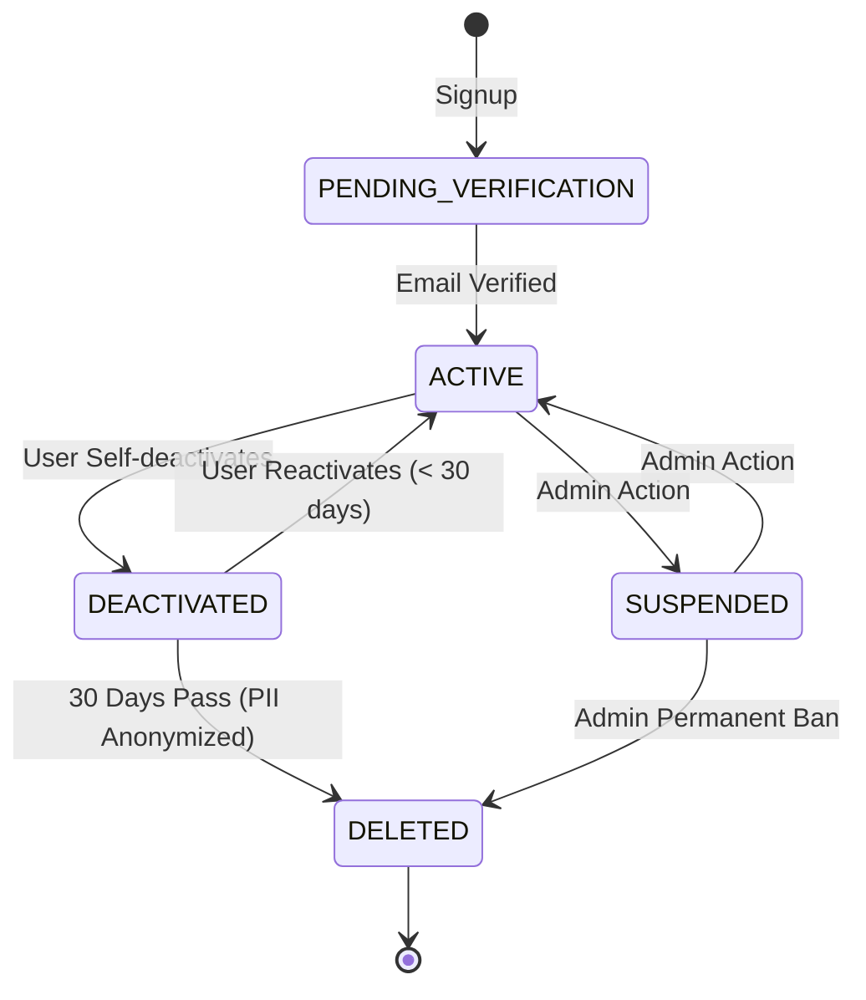
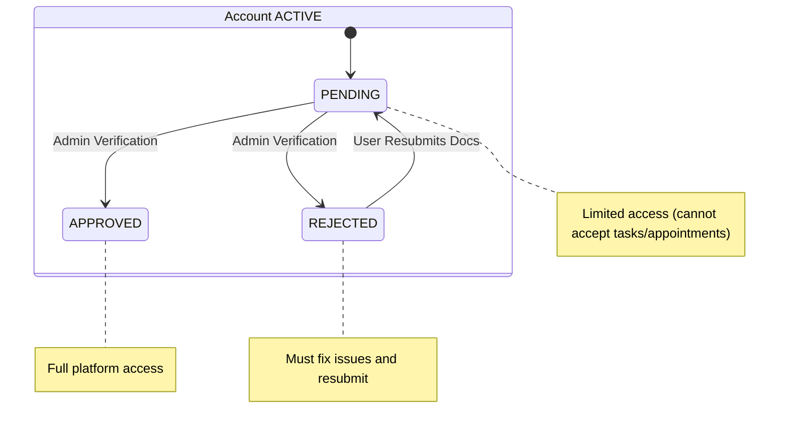

# Ashwasa - Domain Model

This document outlines the core business domains, entities, and relationships for the Ashwasa platform. The platform is designed using a relational database approach, implemented via **PostgreSQL** and the **Prisma ORM**.

## 1. Domain Overview

The system is divided into several logical domains to manage concerns effectively.

### 1.1 Identity & Auth Domain
- **Purpose**: User registration, authentication, and session management.
- **Entities**: `User`
- **Ownership**: Self
- **Security**: RESTRICTED (passwords, tokens, sensitive credentials)
- **Business rules**: Email must be unique, passwords hashed, email verification is required, account lockout occurs after 5 failed login attempts.

### 1.2 Patient Domain
- **Purpose**: Patient-specific profile and health-adjacent contextual data.
- **Entities**: `PatientProfile`
- **Ownership**: Patient user
- **Security**: CONFIDENTIAL (medical notes, emergency contact info)
- **Business rules**: One profile per patient user (1:1 relationship with `User`). Strict data minimization applied.

### 1.3 Doctor Domain
- **Purpose**: Doctor professional profile, verification status, and availability.
- **Entities**: `DoctorProfile`, `AvailabilitySlot`
- **Ownership**: Doctor user (verification controlled by Admin)
- **Security**: INTERNAL (profile data), CONFIDENTIAL (verification documents)
- **Business rules**: Must be verified by Admin before full platform access is granted. Availability slots cannot overlap.

### 1.4 Family Domain
- **Purpose**: Linking patients with family members or caregivers.
- **Entities**: `FamilyRelationship` (Join table/entity between Patient and Family Member)
- **Ownership**: Patient initiates, family member accepts
- **Security**: INTERNAL
- **Business rules**: Patient generates an invite code, family member uses the code to link. The patient can revoke access at any time.

### 1.5 Volunteer Domain
- **Purpose**: Volunteer profile, verification, and task tracking.
- **Entities**: `VolunteerProfile`
- **Ownership**: Volunteer user (verification controlled by Admin)
- **Security**: INTERNAL
- **Business rules**: Must be verified by Admin before accepting any support requests/tasks.

### 1.6 Appointment Domain
- **Purpose**: Scheduling between patients and verified doctors.
- **Entities**: `Appointment`
- **Ownership**: Patient creates, Doctor manages
- **Security**: INTERNAL (metadata), CONFIDENTIAL (appointment notes)
- **Business rules**: Can only be scheduled with verified doctors, strict no double-booking logic, state machine (`REQUESTED` → `CONFIRMED` → `COMPLETED` / `CANCELLED`).

### 1.7 Support Request Domain
- **Purpose**: Non-clinical help requests fulfilled by volunteers.
- **Entities**: `SupportRequest`
- **Ownership**: Patient/Family creates, Volunteer fulfills
- **Security**: INTERNAL
- **Business rules**: Only one active volunteer per request. State machine (`OPEN` → `ASSIGNED` → `IN_PROGRESS` → `COMPLETED` / `CANCELLED`).

### 1.8 Messaging Domain
- **Purpose**: Contextual 1:1 communication tied to active workflows.
- **Entities**: `Conversation`, `Message`
- **Ownership**: Participants
- **Security**: CONFIDENTIAL (message content)
- **Business rules**: Messaging is ONLY permitted between users with an active appointment or support task. Conversations are automatically closed when the associated task or appointment completes.

### 1.9 Notification Domain
- **Purpose**: System notifications and email delivery tracking.
- **Entities**: `Notification`
- **Ownership**: Target user
- **Security**: INTERNAL
- **Business rules**: Event-driven creation. Respects user preferences for email delivery.

### 1.10 Resource Domain
- **Purpose**: Educational content and articles.
- **Entities**: `Resource`
- **Ownership**: Admin creates
- **Security**: PUBLIC (published), INTERNAL (drafts)
- **Business rules**: Strict `DRAFT` / `PUBLISHED` / `ARCHIVED` lifecycle.

### 1.11 File Domain
- **Purpose**: Metadata for uploaded files (physical files stored externally in Cloudinary).
- **Entities**: `File`
- **Ownership**: Uploader
- **Security**: PUBLIC (avatars) or PRIVATE (verification docs)
- **Business rules**: File size limits, MIME type validation, access via signed URLs for private files.

### 1.12 Administration Domain
- **Purpose**: Platform management, moderation, reporting.
- **Entities**: `Report`
- **Ownership**: Reporter creates, Admin reviews
- **Security**: INTERNAL
- **Business rules**: Anyone can report inappropriate behavior or content; only Admins can review and resolve reports.

### 1.13 Audit Domain
- **Purpose**: Immutable record of security-relevant actions.
- **Entities**: `AuditLog`
- **Ownership**: System (triggered by actor)
- **Security**: INTERNAL (accessible to Admin only)
- **Business rules**: NEVER deleted or modified. Permanent retention for compliance.

---

## 2. Domain Relationship Diagram

---

## 3. Role Model

The platform utilizes a strictly layered authorization and role model tailored for a relational database.

- **Role Storage**: Roles are stored as a PostgreSQL `ENUM` on the central `User` table (e.g., `PATIENT`, `FAMILY_MEMBER`, `DOCTOR`, `VOLUNTEER`, `ADMIN`).
- **Profile Separation**: Role-specific details are stored in separate, normalized tables (`PatientProfile`, `DoctorProfile`, `VolunteerProfile`) acting as 1:1 extensions of the `User` table.
- **Authorization Flow**: 
  `User` → `Role` → `Permission` → `Resource Ownership` → `Relationship`
- **Depth of Authorization**: The backend authorization middleware evaluates ALL levels, not just the role.
  - *Example 1 (Ownership)*: A `PATIENT` can view appointments, but only their OWN appointments (must check the foreign key `patientId` on `Appointment`).
  - *Example 2 (Relationship)*: A `FAMILY_MEMBER` can create support requests, but only for a patient they are formally linked to (must check the `FamilyRelationship` table where `status = ACTIVE`).

### Single Role vs Multi-Role Design
For the MVP, a **single-role-per-user** model is sufficient and vastly simplifies security boundaries and UI logic. A user who is a Doctor acts only as a Doctor within the context of their account.
If a multi-role design is needed later, the `role` enum can be converted to a join table (`UserRole`), or a user can have multiple profile records simultaneously. Given the strict separation of profiles, the database schema is already somewhat prepared for this transition.

---

## 4. User Account Lifecycle

Account statuses dictate authentication capability, while profile verification statuses dictate platform functionality.

### Core Account Lifecycle

### Verification Sub-states (Doctors & Volunteers)

Even if a user's account is `ACTIVE`, Doctors and Volunteers require manual Admin verification to utilize the platform:

---

## 5. Message Authorization Rules

Messaging in Ashwasa is strictly contextual. There is no open directory to direct message anyone.

| Sender | Recipient | Condition |
|---|---|---|
| **PATIENT** | **DOCTOR** | Active `CONFIRMED` appointment exists between them |
| **DOCTOR** | **PATIENT** | Active `CONFIRMED` appointment exists between them |
| **PATIENT** | **FAMILY_MEMBER** | Active `FAMILY` relationship exists (`status=ACTIVE`) |
| **FAMILY_MEMBER** | **PATIENT** | Active `FAMILY` relationship exists (`status=ACTIVE`) |
| **PATIENT** | **VOLUNTEER** | Active `ASSIGNED` or `IN_PROGRESS` support request exists |
| **VOLUNTEER** | **PATIENT** | Active `ASSIGNED` or `IN_PROGRESS` support request exists |
| **FAMILY_MEMBER**| **VOLUNTEER** | Active `ASSIGNED` or `IN_PROGRESS` support request exists for linked patient |
| **FAMILY_MEMBER**| **DOCTOR** | Active `CONFIRMED` appointment exists for linked patient |
| **Any** | **ADMIN** | Via Reports only (not direct messaging in MVP) |

**Conversation Lifecycle:**
- **Creation**: Conversations are created automatically by the system when a task is assigned or an appointment is confirmed.
- **Closure**: Conversations are automatically closed (marked read-only) when the underlying task or appointment transitions to a terminal state (`COMPLETED` or `CANCELLED`).
