# Entity-Relationship Diagram

This document illustrates the database schema and relationships for the Ashwasa platform using PostgreSQL and Prisma ORM.

## Entity Relationship Diagram

```mermaid
erDiagram
    users ||--o| patient_profiles : "has"
    users ||--o| doctor_profiles : "has"
    users ||--o| volunteer_profiles : "has"
    
    users ||--o{ family_relationships : "patient"
    users ||--o{ family_relationships : "family_member"
    
    users ||--o{ availability_slots : "doctor"
    
    users ||--o{ appointments : "patient"
    users ||--o{ appointments : "doctor"
    availability_slots |o--o{ appointments : "slot"
    
    users ||--o{ support_requests : "patient"
    users ||--o{ support_requests : "creator"
    users ||--o{ support_requests : "volunteer"
    
    conversations ||--o| appointments : "links_to"
    conversations ||--o| support_requests : "links_to"
    
    conversations ||--o{ conversation_participants : "has"
    users ||--o{ conversation_participants : "participates_in"
    
    conversations ||--o{ messages : "contains"
    users ||--o{ messages : "sends"
    
    users ||--o{ notifications : "receives"
    
    users ||--o{ resources : "authors"
    
    users ||--o{ files : "uploads"
    
    users ||--o{ audit_logs : "actor"
    
    users ||--o{ reports : "reporter"
    users ||--o{ reports : "reviewer"

    users {
        UUID id PK
        String email
        String password_hash
        Enum role
    }
    
    patient_profiles {
        UUID id PK
        UUID user_id FK
        DateTime date_of_birth
    }
    
    doctor_profiles {
        UUID id PK
        UUID user_id FK
        String specialty
    }
    
    volunteer_profiles {
        UUID id PK
        UUID user_id FK
        Integer total_tasks_completed
    }
    
    family_relationships {
        UUID id PK
        UUID patient_id FK
        UUID family_member_id FK
        String status
    }
    
    availability_slots {
        UUID id PK
        UUID doctor_id FK
        Boolean is_booked
    }
    
    appointments {
        UUID id PK
        UUID patient_id FK
        UUID doctor_id FK
        UUID slot_id FK
        UUID conversation_id FK
        String status
    }
    
    support_requests {
        UUID id PK
        UUID patient_id FK
        UUID created_by_id FK
        UUID volunteer_id FK
        UUID conversation_id FK
        String status
    }
    
    conversations {
        UUID id PK
        String context_type
        UUID context_id
    }
    
    conversation_participants {
        UUID id PK
        UUID conversation_id FK
        UUID user_id FK
    }
    
    messages {
        UUID id PK
        UUID conversation_id FK
        UUID sender_id FK
        String content
    }
    
    notifications {
        UUID id PK
        UUID user_id FK
        String type
        Boolean is_read
    }
    
    resources {
        UUID id PK
        String title
        UUID author_id FK
    }
    
    files {
        UUID id PK
        UUID uploaded_by FK
        String original_name
        String storage_url
    }
    
    audit_logs {
        UUID id PK
        String action
        UUID actor_id FK
    }
    
    reports {
        UUID id PK
        UUID reporter_id FK
        UUID reviewed_by FK
        String target_type
        String status
    }
```

## Relationship Summary Table

| From | To | Type | FK Column | ON DELETE |
|---|---|---|---|---|
| patient_profiles | users | One-to-One | user_id | CASCADE |
| doctor_profiles | users | One-to-One | user_id | CASCADE |
| volunteer_profiles | users | One-to-One | user_id | CASCADE |
| family_relationships | users (patient) | Many-to-One | patient_id | CASCADE |
| family_relationships | users (family) | Many-to-One | family_member_id | CASCADE |
| availability_slots | users (doctor) | Many-to-One | doctor_id | CASCADE |
| appointments | users (patient) | Many-to-One | patient_id | CASCADE |
| appointments | users (doctor) | Many-to-One | doctor_id | CASCADE |
| appointments | availability_slots | Many-to-One | slot_id | SET NULL |
| appointments | conversations | One-to-One | conversation_id | SET NULL |
| support_requests | users (patient) | Many-to-One | patient_id | CASCADE |
| support_requests | users (creator) | Many-to-One | created_by_id | CASCADE |
| support_requests | users (volunteer) | Many-to-One | volunteer_id | SET NULL |
| support_requests | conversations | One-to-One | conversation_id | SET NULL |
| conversation_participants | conversations | Many-to-One | conversation_id | CASCADE |
| conversation_participants | users | Many-to-One | user_id | CASCADE |
| messages | conversations | Many-to-One | conversation_id | CASCADE |
| messages | users (sender) | Many-to-One | sender_id | CASCADE |
| notifications | users | Many-to-One | user_id | CASCADE |
| resources | users (author) | Many-to-One | author_id | CASCADE |
| files | users (uploader) | Many-to-One | uploaded_by | CASCADE |
| audit_logs | users (actor) | Many-to-One | actor_id | CASCADE |
| reports | users (reporter) | Many-to-One | reporter_id | CASCADE |
| reports | users (reviewer) | Many-to-One | reviewed_by | SET NULL |
