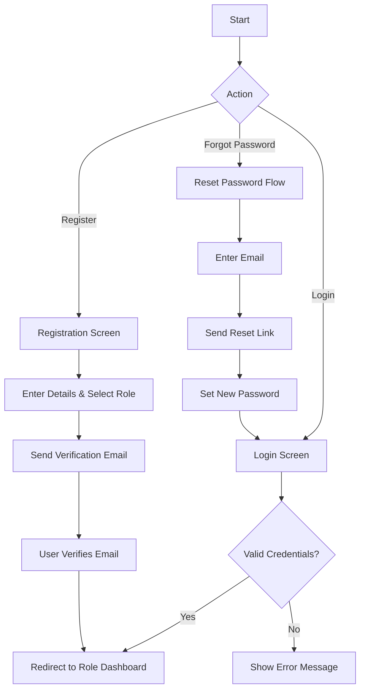
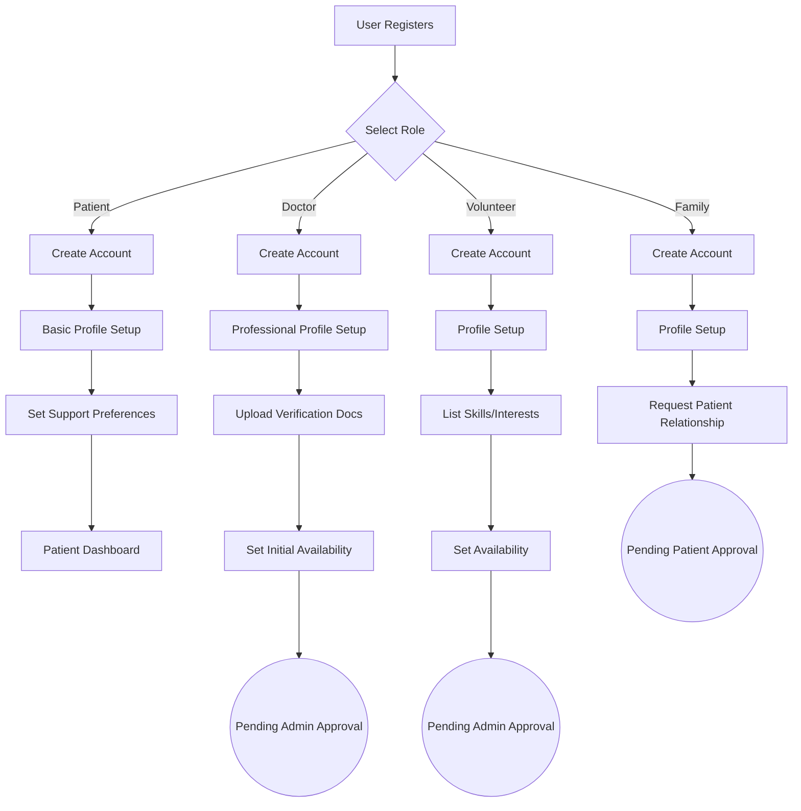
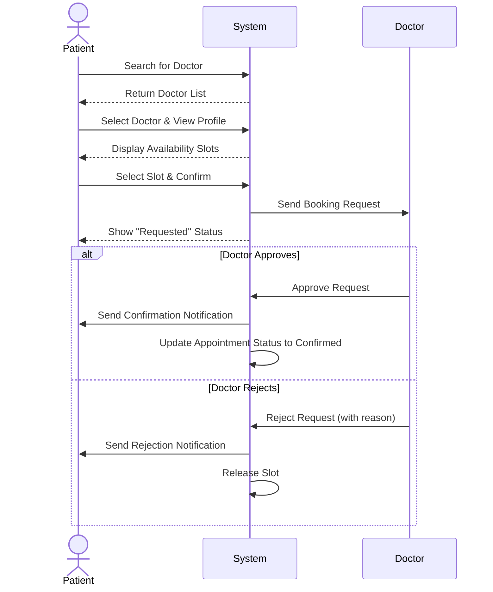
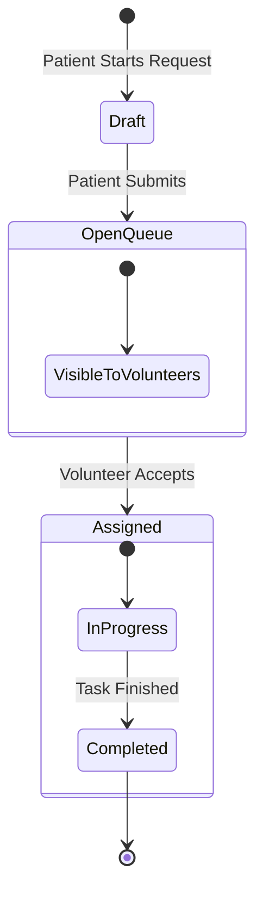
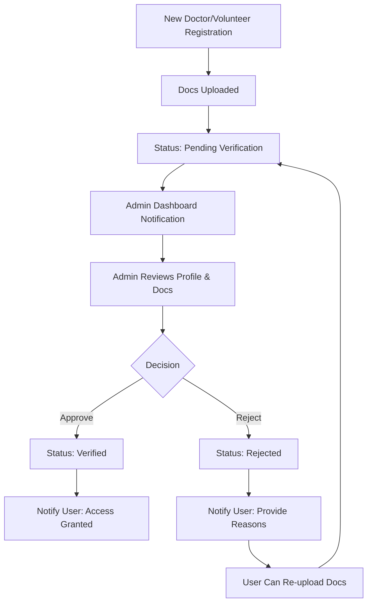

# Ashwasa - Critical User Flows

This document visualizes the critical user journeys within the Ashwasa platform.

## 1. Authentication Flow

## 2. Onboarding Flows

## 3. Appointment Booking Flow

## 4. Support Request Flow

## 5. Admin Verification Flow

